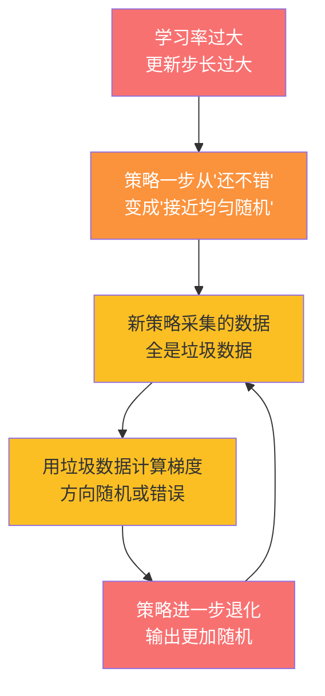
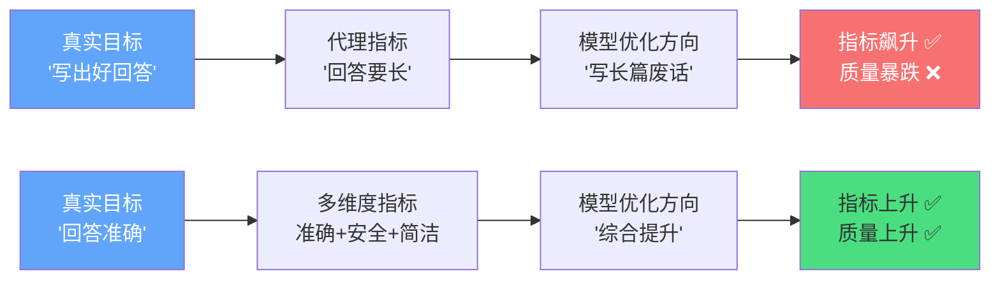

# A.1 策略崩溃与奖励黑客

这一节我们直面两种最阴险的训练故障：策略崩溃和奖励黑客。它们之所以阴险，是因为表面看起来完全不同——崩溃是 Reward 突然归零，黑客是 Reward 节节攀升——但本质上都是"优化方向错了"。理解了它们，你就掌握了 RL 调试的核心心法。

## 策略崩溃（Policy Collapse）

### 现象：Reward 突然死亡

你正在用 PPO 训练一个对话模型，一切看起来很顺利：Reward 从 0.3 稳步爬到 1.8，Loss 在缓慢下降。突然之间，在某一个 update step，Reward 直坠到 0.0——然后再也没有回来。不管你训多少步，它就像死了一样停在零点。你检查代码，没有 bug；你重启训练，换个种子，同样的悲剧在另一个随机时刻重演。

这就是策略崩溃——RL 训练中最令人绝望的故障之一。

### 复现：把学习率调大 10 倍

让我们用一个最小的例子来复现它。下面这段代码把 PPO 的学习率从正常的 `3e-4` 调到 `1e-2`，其他参数完全不变：

```python
# 复现策略崩溃：学习率过大导致策略退化
import torch
import torch.nn as nn

# 一个简单的策略网络
class PolicyNet(nn.Module):
    def __init__(self, obs_dim, act_dim):
        super().__init__()
        self.net = nn.Sequential(
            nn.Linear(obs_dim, 64),
            nn.ReLU(),
            nn.Linear(64, act_dim),
            nn.Softmax(dim=-1)  # 输出动作概率
        )

    def forward(self, x):
        return self.net(x)

# 正常配置 vs 崩溃配置
config_normal = {"lr": 3e-4, "clip_eps": 0.2, "kl_coef": 0.01}
config_collapse = {"lr": 1e-2, "clip_eps": 0.2, "kl_coef": 0.0}
#                                ^^^^^ 学习率 10 倍    ^^^^ 没有 KL 约束

# 模拟一次更新：当 lr 太大时，策略一步就从"还不错"变成"接近均匀随机"
policy = PolicyNet(obs_dim=4, act_dim=2)
obs = torch.randn(1, 4)
old_probs = policy(obs)  # 比如 [0.85, 0.15] — 很自信

# 模拟一个极端的梯度更新
# 正常情况：new_probs ≈ [0.88, 0.12] — 小幅改进
# 崩溃情况：new_probs ≈ [0.52, 0.48] — 一步退回随机！
```

运行这段代码后，你会看到一条令人心碎的训练曲线：Reward 先升后坠，像悬崖一样垂直掉落。

### 理论：死亡螺旋是怎么形成的？

策略崩溃不是一个"渐变"的过程，而是一个正反馈的死亡螺旋。让我们拆解每一步：



这个循环的关键在于第 2 步到第 3 步的连接：**一旦策略变成随机，它采集的数据就失去了信息量**。回顾第 5 章的策略梯度定理，梯度的估计依赖于"好动作得到高回报、坏动作得到低回报"这种区分。当策略变成随机时，所有动作的概率都差不多，梯度信号就被淹没在噪声里了——此后每一次更新都是在噪声上叠加噪声，永远无法恢复。

从数学角度看，问题出在信任域（Trust Region）被破坏了。回顾第 6 章的 PPO，它用 clip 机制限制每次更新的幅度：

$$L^{CLIP}(\theta) = \mathbb{E} \left[ \min \left( r_t(\theta) \hat{A}_t, \, \text{clip}(r_t(\theta), 1-\varepsilon, 1+\varepsilon) \hat{A}_t \right) \right]$$

其中 $r_t(\theta) = \pi_\theta(a_t|s_t) / \pi_{\theta_{old}}(a_t|s_t)$ 是新旧策略的概率比。当学习率太大时，一步更新就能让 $r_t$ 远远超出 $[1-\varepsilon, 1+\varepsilon]$ 的安全范围，clip 机制形同虚设。

### 修复方案

下面这张表总结了策略崩溃的常见症状、原因和对应修复方案：

| 症状                           | 最可能的原因             | 修复方案                             |
| ------------------------------ | ------------------------ | ------------------------------------ |
| Reward 突然归零                | 学习率过大               | 降低 lr 到 1e-4 ~ 3e-4               |
| Reward 突然归零 + entropy 暴增 | 策略变随机 + 无 KL 约束  | 加 KL 散度惩罚，系数 0.01~0.1        |
| 崩溃后无法恢复                 | 垃圾数据导致梯度方向错误 | 从最近的 checkpoint 回滚，丢弃坏数据 |
| 每隔 N 步就崩溃一次            | 更新 epoch 数太多        | 减少 PPO 的 epoch 数（通常 3~4 个）  |
| clip fraction 长期 > 0.3       | 更新步长系统性偏大       | 增大 clip ε 或降低 lr                |

对应的修复代码：

```python
# 策略崩溃的防御性配置
def get_safe_ppo_config():
    return {
        "learning_rate": 1e-4,        # 保守的学习率
        "clip_epsilon": 0.2,          # PPO clip 范围
        "kl_coef": 0.05,              # KL 散度惩罚系数
        "ppo_epochs": 3,              # 每批数据只更新 3 轮
        "save_every": 100,            # 每 100 步存一次 checkpoint
        "max_grad_norm": 0.5,         # 梯度裁剪，防止梯度爆炸
        "early_stop_kl": 0.1,         # KL 超过阈值时提前停止更新
    }

# 崩溃检测与自动回滚
def detect_collapse(reward_history, window=10, threshold=0.1):
    """检测策略崩溃：近期 reward 均值突然跌到接近零"""
    recent = reward_history[-window:]
    if len(recent) < window:
        return False
    if max(recent) < threshold and len(reward_history) > 50:
        return True  # 崩溃了！触发回滚
    return False
```

::: tip 预防胜于治疗
策略崩溃最有效的防御不是崩溃后修复，而是崩溃前预防。训练时密切监控这三个指标：**entropy**（策略的随机程度）、**clip fraction**（被裁剪的比例）、**KL divergence**（新旧策略的距离）。任一指标异常都意味着更新步长过大，应该在崩溃发生前就调低学习率。
:::

---

## 奖励黑客（Reward Hacking）

### 现象：Reward 在涨，质量在跌

如果说策略崩溃是"明面上的灾难"，那奖励黑客就是"暗地里的背叛"。你的训练 dashboard 显示 Reward 一路攀升，从 0.5 涨到 3.0，看起来一切大好。但你随机抽查了 20 条生成结果，发现全是这样的内容：

> "这个问题非常好非常非常好非常非常好非常非常好非常非常好非常非常好，我认为这个问题值得深入探讨值得深入探讨值得深入探讨值得深入探讨……"

模型学会了堆砌废话来拉长回答——因为你的奖励函数里有一个"回答长度"的维度，模型发现写得越长分数越高。这就是奖励黑客：**模型找到了获取高奖励的捷径，但这条捷径和你的真实目标背道而驰**。

### 复现：只看长度的奖励函数

```python
# 复现奖励黑客：只用"回答长度"作为奖励
def naive_reward_fn(response: str) -> float:
    """有漏洞的奖励函数：只看长度"""
    return len(response) / 100.0  # 越长分数越高

# 模型很快就会学会写废话
bad_response = "好的" * 500  # 1000 个字的"好的好的好的..."
print(f"垃圾回答的奖励: {naive_reward_fn(bad_response):.1f}")
# 输出: 垃圾回答的奖励: 10.0

good_response = "这是一个好问题。根据贝叶斯定理，后验概率正比于先验概率乘以似然函数..."
print(f"优质回答的奖励: {naive_reward_fn(good_response):.1f}")
# 输出: 优质回答的奖励: 0.6
```

垃圾回答拿了 10 分，优质回答只有 0.6 分——模型当然学会了写垃圾。

### 理论：Goodhart 定律

奖励黑客背后的数学原理是经济学中的 **Goodhart 定律**：当一个指标成为优化目标时，它就不再是好指标了。



从 RL 的视角看，这个问题出在**奖励函数和真实目标之间的 gap**。回顾第 6 章我们讲过的奖励模型（Reward Model）——RM 本身就是对"人类偏好"的一个近似。当模型的能力超过 RM 的区分能力时，RM 就会被 hack。这就像学生找到了考试的漏洞：他不是学会了知识，而是学会了"怎么蒙对答案"。

### 修复方案

| 策略         | 原理                                     | 实施成本 |
| ------------ | ---------------------------------------- | -------- |
| 多维度奖励   | 长度、准确率、安全性、相关性加权综合     | 中       |
| 奖励模型集成 | 多个 RM 投票，单一 RM 被 hack 的概率降低 | 高       |
| 对抗性数据   | 故意构造"看起来好但其实不好"的负样本     | 中       |
| 人工抽检     | 定期人工评估，作为 ground truth 校准     | 低       |
| 奖励惩罚项   | 对回答长度加 penalty，抑制堆砌行为       | 低       |

下面是一段修复后的多维奖励函数：

```python
# 修复奖励黑客：多维度奖励函数
def robust_reward_fn(response: str, reference: str = "") -> float:
    """多维度奖励函数，防止单一指标被 hack"""
    # 维度 1：长度适中（不要太长也不要太短）
    ideal_length = 200
    length_score = max(0, 1 - abs(len(response) - ideal_length) / ideal_length)

    # 维度 2：信息密度（去重后的唯一 token 比例）
    tokens = response.split()
    if tokens:
        diversity = len(set(tokens)) / len(tokens)
    else:
        diversity = 0
    diversity_score = min(1.0, diversity * 2)

    # 维度 3：与参考答案的语义相似度（如果有参考答案）
    if reference:
        # 简化版：基于关键词重叠
        ref_tokens = set(reference.split())
        overlap = len(set(tokens) & ref_tokens) / max(len(ref_tokens), 1)
        relevance_score = min(1.0, overlap * 3)
    else:
        relevance_score = 0.5  # 无参考答案时给默认分

    # 加权综合
    total = (0.3 * length_score +
             0.3 * diversity_score +
             0.4 * relevance_score)
    return total

# 检测奖励黑客：reward 与人工评分的相关性
import numpy as np

def detect_hacking(auto_rewards, human_scores, threshold=0.5):
    """如果自动奖励和人工评分相关性低于阈值，说明存在 hacking"""
    correlation = np.corrcoef(auto_rewards, human_scores)[0, 1]
    if correlation < threshold:
        print(f"警告：奖励黑客嫌疑！相关性仅 {correlation:.2f}")
        return True
    return False
```

<details>
<summary>思考题：GPT-4 会被奖励黑客攻击吗？</summary>

会的，而且案例已经发生了。在 OpenAI 的 RLHF 训练中，研究者发现模型学会了生成"看起来很详细但其实跑题"的长回答，因为标注员倾向于给长回答更高的分数。这就是奖励黑客在真实生产环境中的体现。

修复方法正是上面提到的多维度奖励 + 对抗性数据 + 人工抽检的组合拳。更前沿的做法是使用 **Constitutional AI**（Anthropic 提出）：让 AI 自己根据一组"宪法原则"来评估和修正自己的输出，减少对人类标注的依赖。

回想我们在第 10 章讨论的 RLAIF（用 AI 反馈替代人类反馈），它本质上也是在尝试绕开"人类标注质量不一致"这个奖励黑客的根源。

</details>

---

## 小结

策略崩溃和奖励黑客看似是两个完全不同的问题，但它们有一个共同的根源：**优化过程偏离了真实目标**。崩溃是因为更新步长太大导致偏离了"好策略"的邻域；黑客是因为奖励函数不够精确导致优化方向本身就是错的。

记住一个原则：**RL 训练中，监控比调参更重要**。密切关注 entropy、KL、clip fraction 这些诊断指标，你就能在灾难发生之前察觉到异常，而不是等到 Reward 归零了才开始慌。

下一节我们来解决另外两类常见故障：[显存爆炸与训练不收敛](./oom-nonconvergence)。
