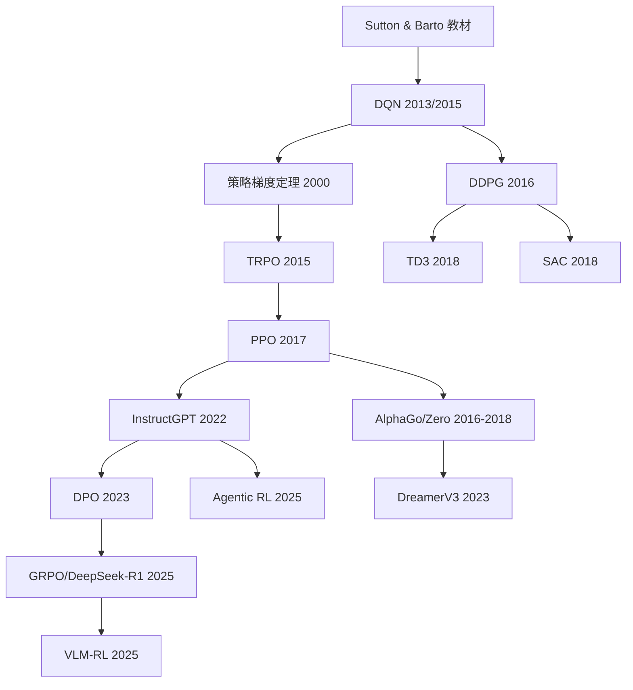

# 附录 F：参考文献

> **本附录目标**：按章节整理本课程引用的关键论文，每篇附一句话中文摘要和链接，方便按图索骥。

## 第1-2章：RL 初印象与现代对齐

| 作者            | 年份 | 标题                                                                           | 核心贡献                                                    | 链接                                                 | 课程引用       |
| --------------- | ---- | ------------------------------------------------------------------------------ | ----------------------------------------------------------- | ---------------------------------------------------- | -------------- |
| Rafailov et al. | 2023 | Direct Preference Optimization: Your Language Model is Secretly a Reward Model | 提出 DPO，用偏好数据直接优化策略，绕过奖励模型训练          | [arXiv:2305.18290](https://arxiv.org/abs/2305.18290) | Ch2 DPO 初体验 |
| Schulman et al. | 2017 | Proximal Policy Optimization Algorithms                                        | 提出 PPO 算法，用裁剪替代 KL 约束，成为 RLHF 的标准训练方法 | [arXiv:1707.06347](https://arxiv.org/abs/1707.06347) | Ch2 PPO 简介   |

**章节导读**：第1章用 CartPole 带你快速感受 RL 训练的全流程，第2章直接上手 DPO 对齐小模型，让你在现代 LLM 对齐的语境下理解 RL 的价值。这两篇论文分别对应两个章节的核心方法。

## 第3章：MDP 与经典理论

| 作者           | 年份 | 标题                                                                  | 核心贡献                                                   | 链接                                                                                             | 课程引用       |
| -------------- | ---- | --------------------------------------------------------------------- | ---------------------------------------------------------- | ------------------------------------------------------------------------------------------------ | -------------- |
| Sutton & Barto | 2018 | Reinforcement Learning: An Introduction (2nd ed.)                     | RL 领域经典教材，系统阐述 MDP、TD 学习、策略梯度等基础理论 | [MIT Press](http://incompleteideas.net/book/the-book.html)                                       | Ch3 全章参考   |
| Williams       | 1992 | Simple Statistical Gradient-Following Algorithms for Connectionist RL | 提出 REINFORCE 算法，策略梯度方法的开山之作                | [link](https://doi.org/10.1007/BF00992696)                                                       | Ch3 经典方法   |
| Bellman        | 1957 | Dynamic Programming                                                   | 提出贝尔曼方程和动态规划框架，RL 理论的数学基石            | [Princeton Press](https://press.princeton.edu/books/paperback/9780691146683/dynamic-programming) | Ch3 贝尔曼方程 |

**章节导读**：第3章是全书的理论地基。Sutton & Barto 的教材是 RL 领域的"圣经"，免费在线阅读，值得收藏。Bellman 的书虽然年代久远，但贝尔曼方程的思想贯穿后续所有章节。

## 第4章：深度 Q 学习 (DQN)

| 作者               | 年份 | 标题                                       | 核心贡献                                                                         | 链接                                               | 课程引用         |
| ------------------ | ---- | ------------------------------------------ | -------------------------------------------------------------------------------- | -------------------------------------------------- | ---------------- |
| Mnih et al.        | 2013 | Playing Atari with Deep RL                 | 首次用深度 Q 网络从原始像素学习玩 Atari 游戏，DRL 开山之作                       | [arXiv:1312.5602](https://arxiv.org/abs/1312.5602) | Ch4 DQN 入门     |
| Mnih et al.        | 2015 | Human-level Control through Deep RL        | DQN 完整版，增加经验回放和目标网络，Nature 论文                                  | [Nature](https://doi.org/10.1038/nature14236)      | Ch4 DQN 三大组件 |
| van Hasselt et al. | 2016 | Deep RL with Double Q-learning             | 提出 Double DQN，解决 Q 值过估计问题                                             | [AAAI](https://arxiv.org/abs/1509.06461)           | Ch4 DQN 家族     |
| Wang et al.        | 2016 | Dueling Network Architectures for Deep RL  | 提出 Dueling DQN，分离状态价值和优势函数                                         | [ICML](https://arxiv.org/abs/1511.06581)           | Ch4 DQN 家族     |
| Hessel et al.      | 2018 | Rainbow: Combining Improvements in Deep RL | 整合六项 DQN 改进（Double、Dueling、Prioritized、Distributional、Noisy、n-step） | [AAAI](https://arxiv.org/abs/1710.02298)           | Ch4 DQN 家族     |
| Schaul et al.      | 2016 | Prioritized Experience Replay              | 提出优先级经验回放，按 TD Error 大小采样                                         | [ICLR](https://arxiv.org/abs/1511.05952)           | Ch4 DQN 组件     |

**章节导读**：2013 年 Mnih 等人的工作标志着深度强化学习的诞生。从 DQN 到 Double DQN、Dueling DQN，再到集大成的 Rainbow，这一脉络展示了值函数方法的演进。建议先读懂 Mnih 2015 的 Nature 论文，再看后续改进。

## 第5章：策略梯度与 Actor-Critic

| 作者             | 年份 | 标题                                                       | 核心贡献                                             | 链接                                                           | 课程引用         |
| ---------------- | ---- | ---------------------------------------------------------- | ---------------------------------------------------- | -------------------------------------------------------------- | ---------------- |
| Sutton et al.    | 2000 | Policy Gradient Methods for RL with Function Approximation | 策略梯度定理的严格证明，奠定了策略梯度方法的理论基础 | [NIPS](https://papers.nips.cc/paper/2000)                      | Ch5 策略梯度定理 |
| Mnih et al.      | 2016 | Asynchronous Methods for Deep RL                           | 提出 A3C，异步多线程 Actor-Critic，显著提升训练效率  | [ICML](https://arxiv.org/abs/1602.01783)                       | Ch5 Actor-Critic |
| Bhatnagar et al. | 2009 | Natural Actor-Critic Algorithms                            | 提出自然梯度在 Actor-Critic 中的应用                 | [Automatica](https://doi.org/10.1016/j.automatica.2009.02.004) | Ch5 进阶阅读     |

**章节导读**：策略梯度定理是连接理论和实践的关键桥梁。Sutton 2000 的证明虽然数学较深，但结论非常实用。A3C 则是第一个大规模并行的深度 RL 方法，启发了后来的 PPO 等算法。

## 第6章：PPO 与奖励模型

| 作者            | 年份 | 标题                                          | 核心贡献                                     | 链接                                      | 课程引用     |
| --------------- | ---- | --------------------------------------------- | -------------------------------------------- | ----------------------------------------- | ------------ |
| Schulman et al. | 2015 | Trust Region Policy Methods (TRPO)            | 提出信任域策略优化，通过 KL 约束保证单调改进 | [ICML](https://arxiv.org/abs/1502.05477)  | Ch6 信任域   |
| Schulman et al. | 2016 | High-Dimensional Continuous Control Using GAE | 提出广义优势估计 (GAE)，平衡偏差与方差       | [ICLR](https://arxiv.org/abs/1506.02438)  | Ch6 GAE      |
| Schulman et al. | 2017 | Proximal Policy Optimization Algorithms       | PPO，用裁剪替代 KL 约束的简化方案            | [arXiv](https://arxiv.org/abs/1707.06347) | Ch6 PPO 全章 |

**章节导读**：PPO 是 RLHF 时代最核心的算法。Schulman 的三篇论文（TRPO -> GAE -> PPO）构成了一个完整的演进路线。GAE 论文尤其重要，它的优势估计方法被几乎所有现代策略梯度算法采用。

## 第7章：对齐方法族

| 作者              | 年份 | 标题                                                                           | 核心贡献                                              | 链接                                      | 课程引用     |
| ----------------- | ---- | ------------------------------------------------------------------------------ | ----------------------------------------------------- | ----------------------------------------- | ------------ |
| Rafailov et al.   | 2023 | Direct Preference Optimization: Your Language Model is Secretly a Reward Model | 绕过奖励模型直接优化偏好，DPO 的原始论文              | [arXiv](https://arxiv.org/abs/2305.18290) | Ch7 DPO 数学 |
| Ethayarajh et al. | 2024 | KTO: Model Alignment as Prospect Theoretic Optimization                        | 只需要二元反馈（好/坏），不需要成对偏好数据           | [arXiv](https://arxiv.org/abs/2402.01306) | Ch7 DPO 家族 |
| Meng et al.       | 2024 | SimPO: Simple Preference Optimization with Reference-Free Reward               | 去掉参考模型，用序列长度归一化的 log 概率作为隐式奖励 | [arXiv](https://arxiv.org/abs/2405.14734) | Ch7 DPO 家族 |
| Azar et al.       | 2024 | A General Theoretical Paradigm for Understanding DPO (IPO)                     | 从一般理论视角统一 DPO 类方法                         | [ICML](https://arxiv.org/abs/2403.00609)  | Ch7 DPO 家族 |

**章节导读**：DPO 开创了"绕过奖励模型"的新范式。之后 KTO 放宽数据要求、SimPO 去掉参考模型、IPO 提供理论统一——这些工作共同构成了对齐方法族。建议先读懂 DPO 的推导，再看变体。

## 第8章：GRPO、DAPO 与 RLVR

| 作者        | 年份 | 标题                                                           | 核心贡献                                     | 链接                                      | 课程引用      |
| ----------- | ---- | -------------------------------------------------------------- | -------------------------------------------- | ----------------------------------------- | ------------- |
| DeepSeek-AI | 2025 | DeepSeek-R1: Incentivizing Reasoning Capability in LLMs via RL | 用 GRPO 训练推理模型，无监督数据实现推理涌现 | [arXiv](https://arxiv.org/abs/2501.12948) | Ch8 DeepSeek  |
| Yu et al.   | 2025 | DAPO: An Open-Source LLM Reinforcement Learning System         | 提出动态采样和组奖励归一化的 PPO 变体        | [arXiv](https://arxiv.org/abs/2503.14476) | Ch8 DAPO      |
| Guo et al.  | 2025 | DeepSeek-R1 with RLVR                                          | 在数学推理任务上验证 LLM 的强化学习训练范式  | [arXiv](https://arxiv.org/abs/2501.12948) | Ch8 RLVR      |
| Shao et al. | 2024 | DeepSeekMath: Pushing the Limits of Mathematical Reasoning     | 在数学推理中引入 GRPO 的前身方法             | [arXiv](https://arxiv.org/abs/2402.03300) | Ch8 GRPO 前身 |

**章节导读**：DeepSeek-R1 的 GRPO 是 2025 年最引人注目的 RL 训练方法之一。它省去了 Critic 网络，用组内统计量做 baseline，大幅简化了训练流程。RLVR 则是用可验证奖励训练 LLM 推理能力的核心范式。

## 第9章：连续控制

| 作者             | 年份 | 标题                                                                  | 核心贡献                                      | 链接                                     | 课程引用 |
| ---------------- | ---- | --------------------------------------------------------------------- | --------------------------------------------- | ---------------------------------------- | -------- |
| Lillicrap et al. | 2016 | Continuous Control with Deep RL (DDPG)                                | 将 DQN 思想扩展到连续动作空间                 | [ICLR](https://arxiv.org/abs/1509.02971) | Ch9 DDPG |
| Fujimoto et al.  | 2018 | Addressing Function Approximation Error in Actor-Critic Methods (TD3) | 提出 TD3，通过双 Q 网络和延迟更新解决过估计   | [ICML](https://arxiv.org/abs/1802.09477) | Ch9 TD3  |
| Haarnoja et al.  | 2018 | Soft Actor-Critic: Off-Policy Maximum Entropy Deep RL (SAC)           | 提出最大熵框架的 Actor-Critic，兼顾探索与利用 | [ICML](https://arxiv.org/abs/1801.01290) | Ch9 SAC  |

**章节导读**：从 DDPG 到 TD3 到 SAC，连续控制算法的演进主线是：解决过估计、加入熵正则化。SAC 是目前连续控制中综合表现最好的算法，也是工业界最常用的选择。

## 第10章：RLHF 完整流水线

| 作者              | 年份 | 标题                                                                              | 核心贡献                                                       | 链接                                        | 课程引用         |
| ----------------- | ---- | --------------------------------------------------------------------------------- | -------------------------------------------------------------- | ------------------------------------------- | ---------------- |
| Ouyang et al.     | 2022 | Training language models to follow instructions with human feedback (InstructGPT) | 完整的 RLHF 流水线：SFT -> Reward Model -> PPO，ChatGPT 的前身 | [NeurIPS](https://arxiv.org/abs/2203.02155) | Ch10 RLHF 流水线 |
| Christiano et al. | 2017 | Deep RL from Human Preferences                                                    | 最早将人类偏好反馈引入深度 RL 训练                             | [NeurIPS](https://arxiv.org/abs/1706.03741) | Ch10 偏好学习    |
| Ziegler et al.    | 2020 | Fine-Tuning Language Models from Human Preferences                                | 首次将偏好学习应用于大语言模型微调                             | [arXiv](https://arxiv.org/abs/1909.08593)   | Ch10 RLHF 历史   |
| Stiennon et al.   | 2020 | Learning to Summarize with Human Feedback                                         | 用人类反馈训练文本摘要模型，RLHF 在 NLP 中的早期应用           | [NeurIPS](https://arxiv.org/abs/2009.01325) | Ch10 RLHF 历史   |

**章节导读**：InstructGPT 论文是理解 RLHF 工业流水线的必读文献。从 Christiano 2017 的早期工作到 Ziegler 和 Stiennon 在 NLP 中的应用，再到 Ouyang 2022 的完整系统，这条线展示了 RLHF 的演进历程。

## 第11章：VLM 强化学习

| 作者        | 年份 | 标题    | 核心贡献                   | 链接                                      | 课程引用         |
| ----------- | ---- | ------- | -------------------------- | ----------------------------------------- | ---------------- |
| Wang et al. | 2025 | VisPlay | 视觉语言模型的 RL 训练框架 | [arXiv](https://arxiv.org/abs/2501.02157) | Ch11 VLM-RL 框架 |

**章节导读**：VLM-RL 是一个快速发展的方向，将 RL 训练从纯文本扩展到视觉-语言多模态场景，面临独特的挑战（如视觉幻觉、跨模态对齐等）。

## 第12章：Agentic RL

| 作者        | 年份 | 标题                                                       | 核心贡献                                         | 链接                                         | 课程引用         |
| ----------- | ---- | ---------------------------------------------------------- | ------------------------------------------------ | -------------------------------------------- | ---------------- |
| Yang et al. | 2025 | ReTool: Reinforcement Learning for Strategic Tool Use      | 用 RL 训练 LLM 学会何时调用工具                  | [arXiv](https://arxiv.org/abs/2504.03620)    | Ch12 工具调用 RL |
| Team VERL   | 2025 | VERL-TOOL                                                  | 基于 VERL 框架的工具调用 RL 训练系统             | [GitHub](https://github.com/volcengine/verl) | Ch12 工程实战    |
| Yao et al.  | 2024 | ReAct: Synergizing Reasoning and Acting in Language Models | 结合推理和行动的 LLM 框架，Agentic RL 的思想先驱 | [ICLR](https://arxiv.org/abs/2210.03629)     | Ch12 Agent 框架  |

**章节导读**：Agentic RL 是 LLM 时代 RL 的新前沿——不再是单轮对话，而是多轮交互、工具调用、自主决策。ReAct 提出了"推理+行动"的范式，ReTool 和 VERL-TOOL 则将 RL 引入工具使用的训练中。

## 第13章：未来趋势

| 作者          | 年份 | 标题                                                                                     | 核心贡献                                       | 链接                                               | 课程引用           |
| ------------- | ---- | ---------------------------------------------------------------------------------------- | ---------------------------------------------- | -------------------------------------------------- | ------------------ |
| Silver et al. | 2016 | Mastering the Game of Go with Deep Neural Networks (AlphaGo)                             | 首次用深度 RL + 蒙特卡洛树搜索击败人类围棋冠军 | [Nature](https://doi.org/10.1038/nature16961)      | Ch13 自博弈        |
| Silver et al. | 2017 | Mastering the Game of Go without Human Knowledge (AlphaGo Zero)                          | 完全不需要人类数据，从自我对弈中学会围棋       | [Nature](https://doi.org/10.1038/nature24270)      | Ch13 自博弈        |
| Silver et al. | 2018 | A General Reinforcement Learning Algorithm that Masters Chess, Shogi, and Go (AlphaZero) | 统一框架通杀棋类游戏，不依赖领域知识           | [Science](https://doi.org/10.1126/science.aar6404) | Ch13 自博弈        |
| Hafner et al. | 2023 | Mastering Diverse Domains through World Models (DreamerV3)                               | 基于世界模型的方法，在多个领域取得 SOTA        | [arXiv](https://arxiv.org/abs/2301.04104)          | Ch13 基于模型的 RL |
| Bai et al.    | 2022 | Constitutional AI: Harmlessness from AI Feedback                                         | 提出 RLAIF，用 AI 自我反馈替代人类标注         | [arXiv](https://arxiv.org/abs/2212.08073)          | Ch13 RLAIF         |
| Ye et al.     | 2025 | FARE: Improving LLM Reasoning via Search-based RL                                        | 测试时搜索与 RL 的结合，推理能力的新范式       | [arXiv](https://arxiv.org/abs/2502.14068)          | Ch13 测试时推理    |

**章节导读**：AlphaGo 系列是自博弈的经典案例，Dreamer 代表基于模型的方法，Constitutional AI 开创了 RLAIF 方向。这些工作指向了 RL 的未来：更强的推理能力、更自主的学习循环、更广泛的应用场景。

## 论文阅读路线图

## 阅读建议

::: tip 怎么读这些论文

1. **课程期间**：不需要通读全文。先看 Abstract 和 Introduction，了解核心思想即可
2. **课后深入**：结合课程章节中的推导，回看论文的 Method 部分会更有感觉
3. **研究方向**：Related Work 和 Appendix 是找课题灵感的宝库
4. **推荐阅读顺序**：按上面流程图的箭头方向，从基础到前沿逐步深入
   :::

::: warning 论文版本注意
RL 领域的论文经常有多个版本（arXiv 预印本、会议版、期刊版）。本索引链接指向的是最容易获取的版本（通常是 arXiv），内容上可能有细微差异。如果正式版有重要修订，以正式版为准。
:::
