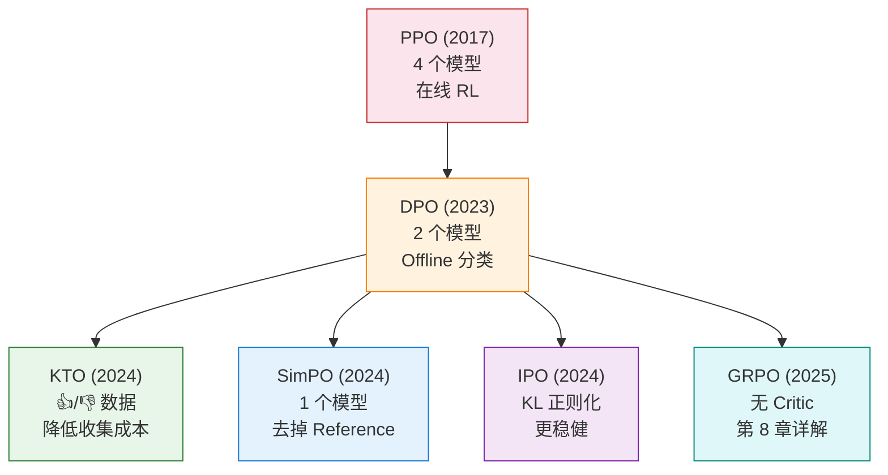

# 7.3 DPO 家族与对比——对齐方法怎么选？

前面两节我们深入了 DPO 的实践和数学。DPO 的核心贡献是证明了一件事：**偏好对齐不一定要走 RLHF 的老路——训练 RM + PPO 优化，一条简单的分类损失就够了**。这个思路一旦被验证，很快就催生了一整个方法家族。它们都基于同一个核心思想（绕过显式 RL），但在数据要求和数学细节上各有特色。这一节我们来做一个全面的对比，帮你建立清晰的选型框架。

## DPO vs PPO：先看核心差异

在展开家族成员之前，先把 DPO 和 PPO 放在一起对比——这是理解所有后续变体的基础：

| 维度                 | DPO                        | PPO                               |
| -------------------- | -------------------------- | --------------------------------- |
| **核心思路**         | 把 RL 问题转化为分类问题   | 在线 RL + 裁剪稳定训练            |
| **需要 RM 吗**       | 不需要（隐式奖励）         | 需要（显式训练）                  |
| **需要 Critic 吗**   | 不需要                     | 需要（估计优势函数）              |
| **需要在线采样吗**   | 不需要（用固定数据集）     | 需要（实时生成数据）              |
| **同时运行的模型数** | 2 个（Policy + Reference） | 4 个（Actor + Critic + Ref + RM） |
| **显存需求**         | 低                         | 高（约 2-4 倍于 DPO）             |
| **数据需求**         | 静态偏好对 $(x, y_w, y_l)$ | 在线采样 + RM 标注                |
| **训练复杂度**       | 低（标准监督学习）         | 高（多模型协调、超参敏感）        |
| **上限**             | 受数据质量限制             | 理论上更高（可在线探索）          |
| **类比**             | 看录像学开车               | 边开车边学                        |

DPO 在工程复杂度上完胜 PPO，但 PPO 在理论上限上更高——因为它可以在训练中不断探索新的回答策略。这个 trade-off 是所有后续方法的核心张力。

理解这个表格的关键在于最后一行——"类比"。DPO 是"看录像学开车"：你只能从已有的录像（偏好数据集）中学习，无法获得新的经验。PPO 是"边开车边学"：你可以实时上路尝试，从真实反馈中学习新的驾驶技巧。前者的优势是安全、简单，后者的优势是上限高、能适应新情况。

从工程实践的角度，如果你只有有限的 GPU 资源（比如单卡 A100），DPO 几乎是唯一的选择——PPO 的四模型并行在单卡上根本跑不动。但如果你有充足的计算资源，PPO 或 GRPO（第 8 章）的在线探索能力可以带来更好的效果。

## KTO：只需要点赞和踩

DPO 需要成对的偏好数据 $(y_w, y_l)$——每个 prompt 必须有一个好回答和一个坏回答。但现实中，**收集成对比较数据的成本很高**：标注员需要仔细阅读两个回答，然后做出精细的比较判断。

KTO（Kahneman-Tversky Optimization）提出了一个更实用的方案：**只需要每个回答的"点赞"或"踩"（👍/👎），不需要成对比较**。

KTO 的名字来自行为经济学中的前景理论（Prospect Theory），由 Kahneman 和 Tversky 提出（Kahneman 因此获得诺贝尔经济学奖）。前景理论的核心发现是：人类对"损失"的敏感度高于对"收益"的敏感度——丢 100 块的痛苦大于捡 100 块的快乐。KTO 把这个思想融入了损失函数：

|              | DPO                      | KTO                          |
| ------------ | ------------------------ | ---------------------------- |
| **数据格式** | 偏好对 $(y_w, y_l)$      | 单个标签 $(y, \text{👍/👎})$ |
| **收集成本** | 高（需要两个回答的比较） | 低（只需一个回答的评价）     |
| **数学基础** | Bradley-Terry 偏好模型   | 前景理论的价值函数           |
| **数据来源** | 专门收集                 | 用户反馈、审核标注           |

KTO 的直觉非常贴近实际场景：当你用 ChatGPT 的时候，你对每个回答点"赞"或"踩"，这本身就是 KTO 所需要的数据。你不需要同时看两个回答再做比较——单个回答的好坏判断就够了。

从数据收集的角度来看，KTO 的优势更加明显。假设你是一个 AI 产品团队，想要利用用户的真实反馈来改进模型。收集 DPO 数据需要：设计 prompt、让模型生成两个回答、请标注员比较。收集 KTO 数据只需要：从生产日志中提取用户的"赞"和"踩"。后者几乎是免费的——用户已经在自然地产生这些信号了。

KTO 的损失函数还融入了前景理论中"损失厌恶"的思想：对 👎 反馈的惩罚力度大于对 👍 反馈的奖励力度。这符合人类学习的直觉——犯错的教训比做对的鼓励更深刻。实验结果表明，这种非对称的权重设计确实能提升训练效果。

## SimPO：连 Reference Model 都不要了

DPO 需要一个冻结的 Reference Model $\pi_{\text{ref}}$ 作为基线来计算概率比值。这个模型虽然不参与梯度计算，但仍然需要占用显存来存储模型参数。

SimPO（Simple Preference Optimization）提出了一个更大胆的简化：**去掉 Reference Model**。SimPO 用回答自身的平均 log 概率替代了与参考模型的比较：

$$r_{\text{SimPO}}(x,y) = \beta \cdot \frac{1}{|y|} \sum_{t=1}^{|y|} \log \pi_\theta(y_t | x, y_{<t})$$

这里不再有 $\pi_{\text{ref}}$——隐式奖励直接用策略模型自身的平均 log 概率来衡量。好回答的平均概率应该比坏回答高，这个逻辑不需要参考模型也能成立。

SimPO 的优势在于：

- **省显存**：少维护一个完整模型，对于 70B 模型来说可以省掉大量显存
- **训练更快**：不需要对 Reference Model 做前向传播
- **实现更简单**：少了 Reference Model 的加载和管理

但 SimPO 也有潜在的风险。没有了 $\pi_{\text{ref}}$ 作为"安全绳"，模型可能过于激进地改变自己的行为——就像开车没有安全带，虽然省了东西，但出了事故后果更严重。SimPO 论文中通过实验发现，在数据质量足够好的情况下，这个风险是可以接受的，但在数据质量较差的场景下，Reference Model 的约束仍然是有价值的。

实际工程中，SimPO 的隐式奖励可以理解为"模型自己对回答的信心程度"。好回答的 token-by-token 概率通常比坏回答高，因为好回答的语言更"自然"、逻辑更"连贯"。平均 log 概率恰好捕捉了这个特征。

## IPO：更稳健的优化

DPO 在数据量少或者偏好信号很弱的时候，可能会过拟合——把 good/bad 的概率差异推到极端。模型可能学会极端地偏好训练集中的好回答，但对没见过的回答类型完全不知所措。

IPO（Identity Preference Optimization）用 KL 正则化替代 DPO 的 log-ratio 形式，提供了一种更稳健的优化方式：

$$\mathcal{L}_{\text{IPO}} = \mathbb{E} \left[ \left( \log \frac{\pi_\theta(y_w|x)}{\pi_{\text{ref}}(y_w|x)} - \log \frac{\pi_\theta(y_l|x)}{\pi_{\text{ref}}(y_l|x)} - \frac{1}{2\beta} \right)^2 \right]$$

IPO 的数学形式比 DPO 更优雅（用均方误差替代了 log-sigmoid），在数据量少时更稳定。它不会像 DPO 那样把概率差异推到极端，因为均方误差天然有一个"目标值"（$1/2\beta$），模型只需要达到这个目标就行，不需要无限拉开差距。

举个例子来说明 IPO 和 DPO 的区别：假设你是一位老师，要让学生区分"好作文"和"坏作文"。DPO 的做法是"好作文的分数必须远高于坏作文"——如果学生能把这个差距拉到无限大，DPO 会非常满意。但这样学生可能会走极端——给好作文打 100 分，给坏作文打负无穷分。IPO 的做法是"好作文的分数比坏作文高 $1/2\beta$ 就够了"——达到目标就停，不需要无限拉开。这种"适可而止"的特性在小数据场景下尤为重要，因为数据少的时候你不确定学到的偏好是否准确，过于激进的优化反而容易过拟合。

实践中的经验是：当偏好数据少于 1000 条时，IPO 的稳定性明显优于 DPO。但当数据量充足（大于 10000 条）时，两者的差距缩小，DPO 的简洁性反而成为优势。

## 选型指南：场景 → 推荐 → 理由

把所有方法放在一起，下面是一个实用的选型决策表：

| 场景                            | 推荐           | 理由                                     |
| ------------------------------- | -------------- | ---------------------------------------- |
| 有大量偏好对数据                | **DPO**        | 经典稳定，生态最好，社区支持最广         |
| 只有👍/👎反馈（如用户数据）     | **KTO**        | 数据格式天然匹配，不需要成对比较         |
| 显存紧张（如 70B 模型单卡训练） | **SimPO**      | 不需要 Reference Model，省掉一个完整模型 |
| 数据量少（几百条以内）          | **IPO**        | 正则化防止过拟合，小数据下更稳定         |
| 追求理论上限                    | **PPO / GRPO** | 在线方法可以探索新策略，上限更高         |
| 快速验证对齐流程                | **DPO**        | 实现最简单，出结果最快                   |

```python
# ==========================================
# 不同方法的快速对比实验（伪代码示意）
# ==========================================

# DPO：需要 (prompt, chosen, rejected) 三元组
# dpo_trainer = DPOTrainer(model, ref_model, train_dataset, beta=0.1)

# KTO：只需要 (prompt, response, label) 标签
# kto_dataset = Dataset.from_dict({
#     "prompt": [...],
#     "completion": [...],
#     "label": [True, False, True, ...],  # True=👍, False=👎
# })
# kto_trainer = KTOTrainer(model, ref_model, train_dataset=kto_dataset)

# SimPO：不需要 ref_model
# simpo_trainer = ...  # 配置中不需要传入 reference model

# IPO：和 DPO 接口类似，但内部损失函数不同
# ipo_trainer = ...  # 使用 IPO 的损失函数替代 DPO Loss

print("选择建议：")
print("  - 第一次做对齐？用 DPO，最快最稳")
print("  - 只有用户反馈数据？用 KTO")
print("  - 显存不够？用 SimPO")
print("  - 数据很少？用 IPO")
print("  - 想要最好的效果？用 PPO 或 GRPO（第 8 章）")
```

## 方法演进的全景

从 PPO 到 DPO 再到 KTO/SimPO/IPO，整个对齐方法的演进遵循一个清晰的方向：**越来越简单，越来越轻量**。



每一次简化都在回答同一个问题：**哪个组件可以安全地去掉？**

- PPO → DPO：去掉了 Reward Model 和 Critic，只保留 Policy 和 Reference
- DPO → KTO：去掉了成对比较的数据要求，只需要单个标签
- DPO → SimPO：去掉了 Reference Model，只保留 Policy
- PPO → GRPO（第 8 章）：去掉了 Critic，用组内比较替代

值得注意的是，这些简化不是线性的。你不能说"DPO 比 PPO 好"或"SimPO 比 DPO 好"——它们是在不同的维度上做简化。DPO 简化了训练流程但失去了在线能力，KTO 简化了数据要求但信号更弱，SimPO 简化了模型数量但缺乏安全约束。实践中，你需要根据自己最紧缺的资源（是显存？数据？算力？还是标注成本？）来选择合适的简化方向。

但要注意，简化不等于"更好"——每一种简化都有代价。DPO 简化了训练，但失去了在线探索的能力；KTO 简化了数据，但信号更弱；SimPO 简化了模型，但缺乏 KL 约束可能导致不稳定。选择哪种方法，取决于你的场景约束。

选择方法时还有一个容易被忽略的维度：**迭代速度**。DPO 的一个隐含优势是实验迭代非常快——改个超参数、换一批数据，重新训练一次只要几十分钟到几小时。PPO 的一次完整训练可能需要几天，而且超参数更敏感。在项目初期，快速迭代比追求单次训练的最优结果更重要。先用 DPO 快速验证数据质量和训练流程，确认可行后再考虑是否切换到 PPO/GRPO 追求更好的效果。

最后一个实践建议是：**不要过度纠结于方法选择，先跑起来再说**。在实践中，数据质量的影响远大于方法选择。一条高质量的偏好数据（包含一个真正有教育意义的"好 vs 坏"对比）比 100 条平庸的数据更有价值。无论你选 DPO、KTO 还是 IPO，如果数据质量不过关，哪种方法都救不回来。所以，先把精力放在数据质量上，方法选择反而没那么关键。

<details>
<summary>思考题：如果你同时拥有偏好对数据和 👍/👎 数据，应该用 DPO 还是 KTO？</summary>

建议**都试一下**，然后比较效果。但有一个启发式原则：

如果偏好对数据量远大于 👍/👎 数据（比如 10000 对 vs 2000 个标签），用 DPO——更丰富的数据会带来更好的训练效果。如果 👍/👎 数据量远大于偏好对（比如用户反馈有 50000 条，但偏好对只有 1000 对），用 KTO——更多的数据能弥补信号较弱的劣势。

还有一种进阶做法是**混合训练**：先用 DPO 学偏好对的精细比较，再用 KTO 利用大量的用户反馈做进一步的优化。这种"两阶段"策略在一些实践中被证明比单独使用任何一种方法都好。

</details>

DPO 家族解决的是"怎么绕过 RM"的问题。但如果我们换一个角度——**不是绕过 RM，而是根本不需要 RM**呢？在数学推理和代码生成这些有客观答案的领域，我们可以直接用规则来验证回答是否正确。这就是第 8 章要讲的内容——GRPO 和 RLVR 把 RL 从"人工裁判"时代带入了"自动验证"时代。

准备好了吗？让我们进入——[第 8 章：GRPO、DAPO 与 RLVR](../chapter08_grpo_rlvr/intro)。
