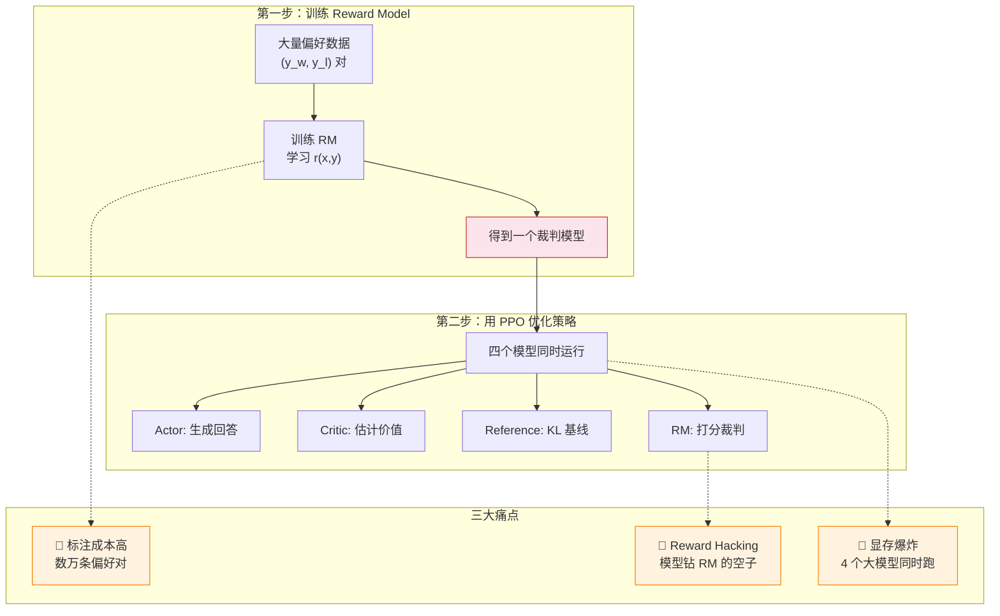
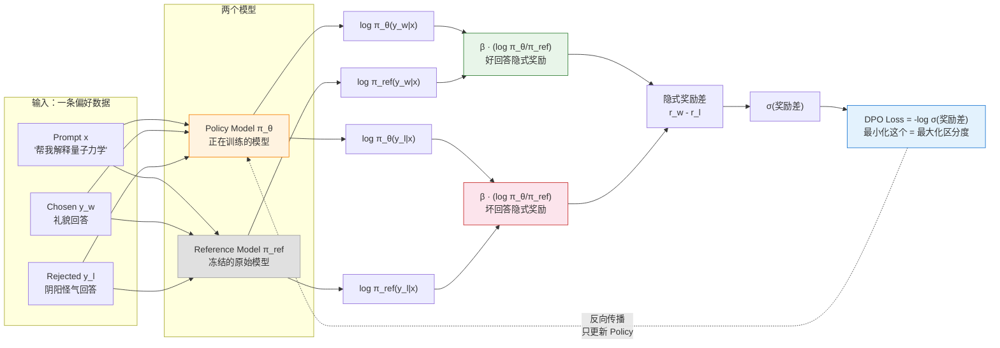

# 7.2 DPO 的数学推导——从 RL 目标到分类损失

第 2 章你已经跑过 DPO 的代码，上一节你也观察了训练指标的起伏。但 DPO 最精彩的部分不在代码里，而在数学推导中——它用三步纯数学变换，把一个包含 4 个模型的 RL 问题等价转化为一个简单的分类损失。这一节我们一步一步推导这个过程。

## 起点：RLHF 的工程痛点

在推导 DPO 之前，让我们先回顾 RLHF 的标准流程，看看它为什么这么痛苦：



RLHF 的原始优化目标是：

$$\max_{\pi_\theta} \; \mathbb{E}_{x \sim \mathcal{D}, y \sim \pi_\theta} \left[ r(x,y) - \beta \cdot D_{\text{KL}}(\pi_\theta \| \pi_{\text{ref}}) \right]$$

这个目标包含两部分：最大化 RM 给的奖励 $r(x,y)$，同时用 KL 散度惩罚策略偏离参考模型太远。$\beta$ 控制两者的权衡。

要优化这个目标，你需要 RM 来提供 $r(x,y)$，需要 Critic 来估计优势函数，需要 Reference 来计算 KL 惩罚——这就是四模型并行的来源。

## DPO 推导三步走

DPO 的天才在于：它不试图优化上面的目标，而是先求出这个目标的最优解长什么样，然后反过来用最优解的表达式消去奖励函数。整个过程分三步：

### 第一步：最优策略的闭式解

上面那个 KL 正则化的优化问题是一个凸问题，它有解析解（closed-form solution）：

$$\pi^*(y|x) = \frac{1}{Z(x)} \pi_{\text{ref}}(y|x) \cdot \exp\left(\frac{r(x,y)}{\beta}\right)$$

其中 $Z(x) = \sum_y \pi_{\text{ref}}(y|x) \cdot \exp(r(x,y)/\beta)$ 是归一化常数。

这个解告诉我们一个关键事实：**最优策略 $\pi^*$ 可以完全由奖励函数 $r$ 和参考策略 $\pi_{\text{ref}}$ 表达**。奖励函数决定了最优策略长什么样。

### 第二步：反解奖励函数

既然最优策略由奖励函数决定，那我们能不能反过来——从最优策略中恢复出奖励函数？

把上式两边取对数并整理：

$$\log \pi^*(y|x) = \log \pi_{\text{ref}}(y|x) + \frac{r(x,y)}{\beta} - \log Z(x)$$

$$r(x,y) = \beta \log \frac{\pi^*(y|x)}{\pi_{\text{ref}}(y|x)} + \beta \log Z(x)$$

这里 $Z(x)$ 是一个只和 prompt $x$ 有关的常数（对同一个 prompt 的所有回答都一样）。当我们在 Bradley-Terry 模型中比较两个回答时，$Z(x)$ 会相消——所以它可以忽略。我们得到：

$$r(x,y) = \beta \log \frac{\pi_\theta(y|x)}{\pi_{\text{ref}}(y|x)}$$

这就是 DPO 最核心的洞察：**奖励函数可以用策略概率的比值来表示**。不需要额外的 RM——策略模型自己就蕴含了奖励信号。

### 第三步：代入 Bradley-Terry 模型

回顾第 6 章的 Bradley-Terry 偏好模型：

$$P(y_w > y_l | x) = \sigma\left( r(x, y_w) - r(x, y_l) \right)$$

把第二步得到的"隐式奖励"代入：

$$P(y_w > y_l | x) = \sigma\left( \beta \log \frac{\pi_\theta(y_w|x)}{\pi_{\text{ref}}(y_w|x)} - \beta \log \frac{\pi_\theta(y_l|x)}{\pi_{\text{ref}}(y_l|x)} \right)$$

奖励函数 $r$ 完全消失了！我们得到了一个**只依赖策略概率**的偏好模型。最大似然估计对应的损失函数是：

$$\mathcal{L}_{\text{DPO}} = -\mathbb{E}_{(x, y_w, y_l)} \left[ \log \sigma \left( \beta \log \frac{\pi_\theta(y_w|x)}{\pi_{\text{ref}}(y_w|x)} - \beta \log \frac{\pi_\theta(y_l|x)}{\pi_{\text{ref}}(y_l|x)} \right) \right]$$

这就是你在第 2 章代码里调的那个 `DPOTrainer` 背后的真正面目。让我们用一个表格来对照一下公式里的每个符号：

| 公式部分                                                         | 含义             | 直觉                                           |
| ---------------------------------------------------------------- | ---------------- | ---------------------------------------------- |
| $\beta \log \frac{\pi_\theta(y_w\|x)}{\pi_{\text{ref}}(y_w\|x)}$ | 好回答的隐式奖励 | "相对于参考模型，模型现在更偏好不好回答了多少" |
| $\beta \log \frac{\pi_\theta(y_l\|x)}{\pi_{\text{ref}}(y_l\|x)}$ | 坏回答的隐式奖励 | "相对于参考模型，模型现在更偏好不好回答了多少" |
| 两者相减                                                         | 好坏回答的奖励差 | "好回答比坏回答好了多少"                       |
| $\sigma(\cdot)$                                                  | 压缩到 [0, 1]    | "有多确定好回答确实更好"                       |
| $-\log \sigma(\cdot)$                                            | 交叉熵损失       | "让这个确定性越大越好"                         |

### DPO 数据流全景



注意一个关键细节：**反向传播只更新 Policy Model，Reference Model 是冻结的**。所以 DPO 只需要维护两个模型（Policy + Reference），而且 Reference 不参与梯度计算，实际的显存开销比 PPO 小得多。

## 隐式奖励：RM 藏在策略模型里面

从第二步的推导中，我们得到了一个非常重要的关系：

$$r(x,y) = \beta \log \frac{\pi_\theta(y|x)}{\pi_{\text{ref}}(y|x)}$$

这意味着 DPO 训练后的模型内部**实际蕴含了一个奖励模型**。你可以用它来给任意回答打分：

```python
# ==========================================
# 用 DPO 隐式奖励给回答打分
# ==========================================
import torch

def implicit_reward(policy_model, ref_model, tokenizer, prompt, response, beta=0.1):
    """
    计算 DPO 的隐式奖励：r(x,y) = β * log(π_θ(y|x) / π_ref(y|x))
    """
    # 拼接 prompt 和 response
    text = prompt + response
    inputs = tokenizer(text, return_tensors="pt")

    # 计算策略模型和参考模型的 log 概率
    with torch.no_grad():
        policy_outputs = policy_model(**inputs)
        ref_outputs = ref_model(**inputs)

        # 取每个 token 的 log 概率
        policy_log_probs = policy_outputs.logits.log_softmax(dim=-1)
        ref_log_probs = ref_outputs.logits.log_softmax(dim=-1)

    # 简化：用平均 log 概率作为序列级别的分数
    # 实际实现中会用 token-level 的 log prob 求和
    reward = beta * (policy_log_probs.mean() - ref_log_probs.mean())
    return reward.item()

# 示例：比较两个回答的隐式奖励
prompt = "帮我解释一下量子力学。"
good_response = "量子力学是研究微观粒子行为的物理学..."
bad_response = "哦量子力学啊，简单到你都不需要我解释..."

r_good = implicit_reward(model, ref_model, tokenizer, prompt, good_response)
r_bad = implicit_reward(model, ref_model, tokenizer, prompt, bad_response)

print(f"好回答的隐式奖励: {r_good:.4f}")
print(f"坏回答的隐式奖励: {r_bad:.4f}")
print(f"奖励差距: {r_good - r_bad:.4f}")
```

隐式奖励的意义在于：**DPO 不是没有奖励模型，而是把奖励模型"藏"在了策略模型内部**。你不需要额外训练和维护一个独立的 RM——策略模型自己就能给自己打分。这就是 DPO 名字中"Direct"（直接）的含义：**直接**从偏好数据中学习策略，**跳过**显式训练 RM 的中间步骤。

## DPO 的局限性

DPO 很优雅，但它不是万能的：

1. **依赖数据质量**：DPO 是 offline 方法，只能从固定的偏好数据集中学习。如果数据集覆盖的场景不够多，模型在新场景下的表现可能不佳。
2. **无法探索**：PPO 可以在训练中不断尝试新的回答并从 RM 获得反馈，而 DPO 只能看到数据集中已有的回答。这意味着 DPO 的上限受数据质量限制。
3. **偏好冲突**：如果不同标注者对同一对回答给出了矛盾的意见（A 觉得好，B 觉得不好），DPO 可能会困惑。

<details>
<summary>思考题：DPO 的隐式奖励 $r(x,y) = \beta \log(\pi_\theta / \pi_{\text{ref}})$ 和第 6 章 PPO 的 KL 惩罚有什么关系？</summary>

它们本质上是同一个东西的两面。PPO 的目标函数中有 $-\beta \cdot D_{\text{KL}}(\pi_\theta \| \pi_{\text{ref}})$ 这一项，防止策略偏离参考模型太远。而 DPO 的隐式奖励 $\beta \log(\pi_\theta / \pi_{\text{ref}})$ 就是 KL 散度中的对数项——它是 KL 散度的"逐点版本"。

PPO 在训练时显式地计算 KL 散度并惩罚偏离；DPO 通过数学推导把这个约束"内置"到了损失函数中——当你优化 DPO 的损失时，KL 约束自然被满足了。这是 DPO 推导的数学美感之一：不需要额外的惩罚项，约束已经隐含在公式结构中了。

</details>

<details>
<summary>思考题：如果 DPO 训练后 Policy 和 Reference 变得一模一样（π_θ = π_ref），隐式奖励会变成什么？这说明什么？</summary>

隐式奖励会变成 $r(x,y) = \beta \log(1) = 0$，对所有回答都打零分。这说明模型没有从偏好数据中学到任何东西——它完全保持了原始模型的行为，没有做任何调整。

这种情况可能发生在 $\beta$ 设置得太大的时候——KL 惩罚太强，模型不敢偏离参考模型。也有可能是学习率太低或者训练步数不够。在监控 DPO 训练时，如果发现 Chosen Reward 和 Rejected Reward 一直都在零附近，没有拉开差距，就说明模型没有在学。

</details>

DPO 是绕过 RM 的第一个成功尝试，但不是唯一一个。它的成功催生了一整个"对齐方法族"——KTO、SimPO、IPO，它们各有各的适用场景。让我们看看这个家族的全貌——[DPO 家族与对比](./dpo-family)。
