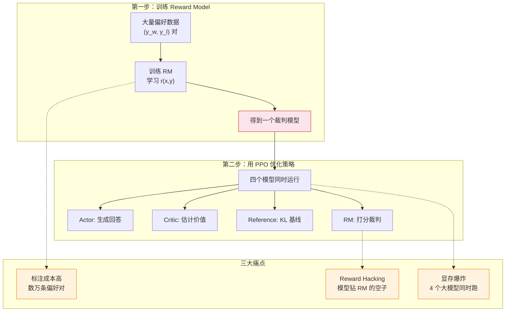
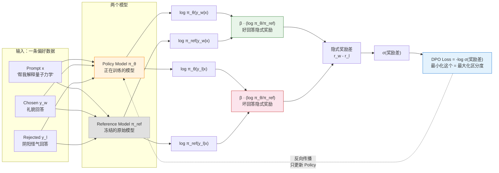
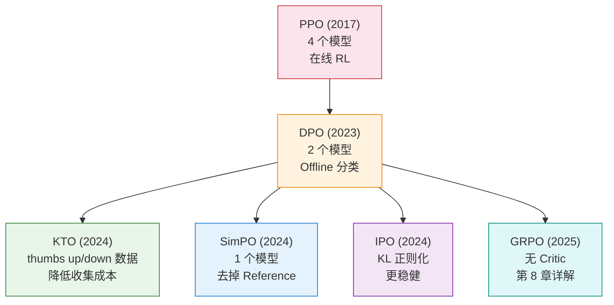

# 7.3 DPO 原理、数学与选型

前面你跑过了 DPO 的代码，也观察了训练指标的起伏。但 DPO 最精彩的部分不在代码里，而在数学推导中——它用三步纯数学变换，把一个包含 4 个模型的 RL 问题等价转化为一个简单的分类损失。这一节我们一步一步推导这个过程，然后看看 DPO 催生的整个方法家族，帮你建立清晰的选型框架。

## 7.3.1 DPO 推导三步走

### 起点：RLHF 的工程痛点

在推导 DPO 之前，先回顾 RLHF 的标准流程，看看它为什么这么痛苦：



RLHF 的原始优化目标是：

$$\max_{\pi_\theta} \; \mathbb{E}_{x \sim \mathcal{D}, y \sim \pi_\theta} \left[ r(x,y) - \beta \cdot D_{\text{KL}}(\pi_\theta \| \pi_{\text{ref}}) \right]$$

这个目标包含两部分：最大化 RM 给的奖励 $r(x,y)$，同时用 KL 散度惩罚策略偏离参考模型太远。$\beta$ 控制两者的权衡。要优化这个目标，你需要 RM 来提供 $r(x,y)$，需要 Critic 来估计优势函数，需要 Reference 来计算 KL 惩罚——这就是四模型并行的来源。

### 第一步：最优策略的闭式解

上面那个 KL 正则化的优化问题是一个凸问题，它有解析解（closed-form solution）：

$$\pi^*(y|x) = \frac{1}{Z(x)} \pi_{\text{ref}}(y|x) \cdot \exp\left(\frac{r(x,y)}{\beta}\right)$$

其中 $Z(x) = \sum_y \pi_{\text{ref}}(y|x) \cdot \exp(r(x,y)/\beta)$ 是归一化常数。

这个解告诉我们一个关键事实：**最优策略 $\pi^*$ 可以完全由奖励函数 $r$ 和参考策略 $\pi_{\text{ref}}$ 表达**。奖励函数决定了最优策略长什么样。

### 第二步：反解奖励函数

既然最优策略由奖励函数决定，那我们能不能反过来——从最优策略中恢复出奖励函数？把上式两边取对数并整理：

$$\log \pi^*(y|x) = \log \pi_{\text{ref}}(y|x) + \frac{r(x,y)}{\beta} - \log Z(x)$$

$$r(x,y) = \beta \log \frac{\pi^*(y|x)}{\pi_{\text{ref}}(y|x)} + \beta \log Z(x)$$

这里 $Z(x)$ 是一个只和 prompt $x$ 有关的常数（对同一个 prompt 的所有回答都一样）。当我们在 Bradley-Terry 模型中比较两个回答时，$Z(x)$ 会相消——所以它可以忽略。我们得到：

$$r(x,y) = \beta \log \frac{\pi_\theta(y|x)}{\pi_{\text{ref}}(y|x)}$$

这就是 DPO 最核心的洞察：**奖励函数可以用策略概率的比值来表示**。不需要额外的 RM——策略模型自己就蕴含了奖励信号。

### 第三步：代入 Bradley-Terry 模型

回顾第 6 章的 Bradley-Terry 偏好模型：

$$P(y_w > y_l | x) = \sigma\left( r(x, y_w) - r(x, y_l) \right)$$

把第二步得到的"隐式奖励"代入：

$$P(y_w > y_l | x) = \sigma\left( \beta \log \frac{\pi_\theta(y_w|x)}{\pi_{\text{ref}}(y_w|x)} - \beta \log \frac{\pi_\theta(y_l|x)}{\pi_{\text{ref}}(y_l|x)} \right)$$

奖励函数 $r$ 完全消失了！我们得到了一个**只依赖策略概率**的偏好模型。最大似然估计对应的损失函数是：

$$\mathcal{L}_{\text{DPO}} = -\mathbb{E}_{(x, y_w, y_l)} \left[ \log \sigma \left( \beta \log \frac{\pi_\theta(y_w|x)}{\pi_{\text{ref}}(y_w|x)} - \beta \log \frac{\pi_\theta(y_l|x)}{\pi_{\text{ref}}(y_l|x)} \right) \right]$$

这就是你在第 2 章代码里调的那个 `DPOTrainer` 背后的真正面目：

| 公式部分                                                         | 含义             | 直觉                                           |
| ---------------------------------------------------------------- | ---------------- | ---------------------------------------------- |
| $\beta \log \frac{\pi_\theta(y_w\|x)}{\pi_{\text{ref}}(y_w\|x)}$ | 好回答的隐式奖励 | "相对于参考模型，模型现在更偏好不好回答了多少" |
| $\beta \log \frac{\pi_\theta(y_l\|x)}{\pi_{\text{ref}}(y_l\|x)}$ | 坏回答的隐式奖励 | "相对于参考模型，模型现在更偏好不好回答了多少" |
| 两者相减                                                         | 好坏回答的奖励差 | "好回答比坏回答好了多少"                       |
| $\sigma(\cdot)$                                                  | 压缩到 [0, 1]    | "有多确定好回答确实更好"                       |
| $-\log \sigma(\cdot)$                                            | 交叉熵损失       | "让这个确定性越大越好"                         |

### DPO 数据流全景



注意一个关键细节：**反向传播只更新 Policy Model，Reference Model 是冻结的**。所以 DPO 只需要维护两个模型（Policy + Reference），而且 Reference 不参与梯度计算，实际的显存开销比 PPO 小得多。

## 7.3.2 隐式奖励

从第二步的推导中，我们得到了一个非常重要的关系：

$$r(x,y) = \beta \log \frac{\pi_\theta(y|x)}{\pi_{\text{ref}}(y|x)}$$

这意味着 DPO 训练后的模型内部**实际蕴含了一个奖励模型**。你可以用它来给任意回答打分：

```python
# ==========================================
# 用 DPO 隐式奖励给回答打分
# ==========================================
import torch

def implicit_reward(policy_model, ref_model, tokenizer, prompt, response, beta=0.1):
    """
    计算 DPO 的隐式奖励：r(x,y) = β * log(π_θ(y|x) / π_ref(y|x))
    """
    # 拼接 prompt 和 response
    text = prompt + response
    inputs = tokenizer(text, return_tensors="pt")

    # 计算策略模型和参考模型的 log 概率
    with torch.no_grad():
        policy_outputs = policy_model(**inputs)
        ref_outputs = ref_model(**inputs)

        # 取每个 token 的 log 概率
        policy_log_probs = policy_outputs.logits.log_softmax(dim=-1)
        ref_log_probs = ref_outputs.logits.log_softmax(dim=-1)

    # 简化：用平均 log 概率作为序列级别的分数
    # 实际实现中会用 token-level 的 log prob 求和
    reward = beta * (policy_log_probs.mean() - ref_log_probs.mean())
    return reward.item()

# 示例：比较两个回答的隐式奖励
prompt = "帮我解释一下量子力学。"
good_response = "量子力学是研究微观粒子行为的物理学..."
bad_response = "哦量子力学啊，简单到你都不需要我解释..."

r_good = implicit_reward(model, ref_model, tokenizer, prompt, good_response)
r_bad = implicit_reward(model, ref_model, tokenizer, prompt, bad_response)

print(f"好回答的隐式奖励: {r_good:.4f}")
print(f"坏回答的隐式奖励: {r_bad:.4f}")
print(f"奖励差距: {r_good - r_bad:.4f}")
```

隐式奖励的意义在于：**DPO 不是没有奖励模型，而是把奖励模型"藏"在了策略模型内部**。你不需要额外训练和维护一个独立的 RM——策略模型自己就能给自己打分。这就是 DPO 名字中"Direct"（直接）的含义：**直接**从偏好数据中学习策略，**跳过**显式训练 RM 的中间步骤。

<details>
<summary>思考题：DPO 的隐式奖励 $r(x,y) = \beta \log(\pi_\theta / \pi_{\text{ref}})$ 和第 6 章 PPO 的 KL 惩罚有什么关系？</summary>

它们本质上是同一个东西的两面。PPO 的目标函数中有 $-\beta \cdot D_{\text{KL}}(\pi_\theta \| \pi_{\text{ref}})$ 这一项，防止策略偏离参考模型太远。而 DPO 的隐式奖励 $\beta \log(\pi_\theta / \pi_{\text{ref}})$ 就是 KL 散度中的对数项——它是 KL 散度的"逐点版本"。

PPO 在训练时显式地计算 KL 散度并惩罚偏离；DPO 通过数学推导把这个约束"内置"到了损失函数中——当你优化 DPO 的损失时，KL 约束自然被满足了。这是 DPO 推导的数学美感之一：不需要额外的惩罚项，约束已经隐含在公式结构中了。

</details>

## 7.3.3 DPO 的局限性与家族演进

DPO 很优雅，但它不是万能的：

1. **依赖数据质量**：DPO 是 offline 方法，只能从固定的偏好数据集中学习。如果数据集覆盖的场景不够多，模型在新场景下的表现可能不佳。
2. **无法探索**：PPO 可以在训练中不断尝试新的回答并从 RM 获得反馈，而 DPO 只能看到数据集中已有的回答。这意味着 DPO 的上限受数据质量限制。
3. **偏好冲突**：如果不同标注者对同一对回答给出了矛盾的意见，DPO 可能会困惑。

这些局限的核心张力可以用一个类比来概括——DPO 是"看录像学开车"（只能从已有数据中学习），而 PPO 是"边开车边学"（可以在线探索）。下面的表格把这个类比展开：

| 维度                 | DPO                        | PPO                               |
| -------------------- | -------------------------- | --------------------------------- |
| **核心思路**         | 把 RL 问题转化为分类问题   | 在线 RL + 裁剪稳定训练            |
| **需要 RM 吗**       | 不需要（隐式奖励）         | 需要（显式训练）                  |
| **需要 Critic 吗**   | 不需要                     | 需要（估计优势函数）              |
| **需要在线采样吗**   | 不需要（用固定数据集）     | 需要（实时生成数据）              |
| **同时运行的模型数** | 2 个（Policy + Reference） | 4 个（Actor + Critic + Ref + RM） |
| **显存需求**         | 低                         | 高（约 2-4 倍于 DPO）             |
| **训练复杂度**       | 低（标准监督学习）         | 高（多模型协调、超参敏感）        |
| **上限**             | 受数据质量限制             | 理论上更高（可在线探索）          |

DPO 在工程复杂度上完胜 PPO，但 PPO 在理论上限上更高。正是这个 trade-off 催生了 DPO 家族——一系列方法都在回答同一个问题：**哪个组件可以安全地去掉？**

## 7.3.4 KTO、SimPO、IPO 速览

DPO 的核心贡献是证明了"偏好对齐不一定要走 RLHF 的老路"。这个思路一旦被验证，很快就催生了一整个方法家族——它们都绕过显式 RL，但在数据要求和数学细节上各有特色。

### KTO：只需要点赞和踩

DPO 需要成对的偏好数据 $(y_w, y_l)$，但现实中收集成对比较数据的成本很高。KTO（Kahneman-Tversky Optimization）提出了一个更实用的方案：**只需要每个回答的"点赞"或"踩"（thumbs up / thumbs down），不需要成对比较**。

KTO 的名字来自行为经济学中的前景理论——人类对"损失"的敏感度高于对"收益"的敏感度。KTO 把这个思想融入了损失函数：对 negative 反馈的惩罚力度大于对 positive 反馈的奖励力度。

从数据收集的角度看，KTO 的优势更加明显。假设你是一个 AI 产品团队：收集 DPO 数据需要设计 prompt、让模型生成两个回答、请标注员比较——流程重、成本高；收集 KTO 数据只需要从生产日志中提取用户的"赞"和"踩"——几乎是免费的，因为用户已经在自然地产生这些信号了。

### SimPO：连 Reference Model 都不要了

DPO 需要一个冻结的 Reference Model $\pi_{\text{ref}}$ 作为基线。SimPO（Simple Preference Optimization）用回答自身的平均 log 概率替代了与参考模型的比较：

$$r_{\text{SimPO}}(x,y) = \beta \cdot \frac{1}{|y|} \sum_{t=1}^{|y|} \log \pi_\theta(y_t | x, y_{<t})$$

不再有 $\pi_{\text{ref}}$——隐式奖励直接用策略模型自身的平均 log 概率来衡量。省显存（少维护一个完整模型）、训练更快（不需要对 Reference Model 做前向传播）、实现更简单。但没有了 $\pi_{\text{ref}}$ 作为"安全绳"，模型可能过于激进地改变自己的行为——就像开车没有安全带，虽然省了东西，但出了事故后果更严重。SimPO 论文通过实验发现，数据质量足够好时这个风险可以接受，但数据质量差时 Reference Model 的约束仍然有价值。

### IPO：更稳健的优化

DPO 在数据量少或偏好信号很弱的时候可能过拟合。IPO（Identity Preference Optimization）用 KL 正则化替代 DPO 的 log-ratio 形式：

$$\mathcal{L}_{\text{IPO}} = \mathbb{E} \left[ \left( \log \frac{\pi_\theta(y_w|x)}{\pi_{\text{ref}}(y_w|x)} - \log \frac{\pi_\theta(y_l|x)}{\pi_{\text{ref}}(y_l|x)} - \frac{1}{2\beta} \right)^2 \right]$$

IPO 用均方误差替代了 log-sigmoid，天然有一个"目标值"（$1/2\beta$），模型只需要达到这个目标就行，不需要无限拉开差距。打个比方：DPO 要求"好作文的分数必须远高于坏作文"（差距越大越好），IPO 要求"好作文比坏作文高 $1/2\beta$ 就够了"（适可而止）。这种"适可而止"的特性在小数据场景下尤为重要——数据少时你不确定学到的偏好是否准确，过于激进的优化反而容易过拟合。经验上，当偏好数据少于 1000 条时，IPO 的稳定性明显优于 DPO；数据量超过 10000 条时，两者差距缩小。

### 一张表看懂家族差异

| 维度         | DPO                         | KTO                                   | SimPO                    | IPO                 |
| ------------ | --------------------------- | ------------------------------------- | ------------------------ | ------------------- |
| **数据格式** | 偏好对 $(y_w, y_l)$         | 单个标签 $(y, \text{thumbs up/down})$ | 偏好对 $(y_w, y_l)$      | 偏好对 $(y_w, y_l)$ |
| **数据收集** | 高（需要两个回答的比较）    | 低（只需一个回答的评价）              | 高（同 DPO）             | 高（同 DPO）        |
| **需要 Ref** | 需要                        | 需要                                  | **不需要**               | 需要                |
| **数学基础** | Bradley-Terry + log-sigmoid | 前景理论价值函数                      | 平均 log 概率            | 均方误差 + KL 正则  |
| **核心优势** | 经典稳定，生态最好          | 数据格式灵活，收集成本低              | 省显存（少一个完整模型） | 小数据下更稳定      |
| **适用场景** | 通用首选                    | 用户反馈、审核标注                    | 大模型单卡训练           | 数据少于 1000 条    |

## 7.3.5 选型指南

把所有方法放在一起，下面是一个实用的选型决策表：

| 场景                            | 推荐           | 理由                                     |
| ------------------------------- | -------------- | ---------------------------------------- |
| 有大量偏好对数据                | **DPO**        | 经典稳定，生态最好，社区支持最广         |
| 只有 thumbs up/down 反馈        | **KTO**        | 数据格式天然匹配，不需要成对比较         |
| 显存紧张（如 70B 模型单卡训练） | **SimPO**      | 不需要 Reference Model，省掉一个完整模型 |
| 数据量少（几百条以内）          | **IPO**        | 正则化防止过拟合，小数据下更稳定         |
| 追求理论上限                    | **PPO / GRPO** | 在线方法可以探索新策略，上限更高         |
| 快速验证对齐流程                | **DPO**        | 实现最简单，出结果最快                   |



每一次简化都在回答同一个问题：**哪个组件可以安全地去掉？**

- PPO → DPO：去掉了 Reward Model 和 Critic，只保留 Policy 和 Reference
- DPO → KTO：去掉了成对比较的数据要求，只需要单个标签
- DPO → SimPO：去掉了 Reference Model，只保留 Policy
- PPO → GRPO：去掉了 Critic，用组内比较替代

这些简化不是线性的。你不能说"SimPO 比 DPO 好"——它们是在不同的维度上做简化。选择哪种方法，取决于你最紧缺的资源：是显存、数据、算力、还是标注成本？

选择方法时还有一个容易被忽略的维度：**迭代速度**。DPO 的一个隐含优势是实验迭代非常快——改个超参数、换一批数据，重新训练一次只要几十分钟到几小时。PPO 的一次完整训练可能需要几天，而且超参数更敏感。在项目初期，快速迭代比追求单次训练的最优结果更重要：先用 DPO 快速验证数据质量和训练流程，确认可行后再考虑是否切换到 PPO/GRPO 追求更好的效果。

最后一条实践建议：**不要过度纠结于方法选择，先跑起来再说**。数据质量的影响远大于方法选择——一条高质量的偏好数据比 100 条平庸的数据更有价值。无论你选 DPO、KTO 还是 IPO，如果数据质量不过关，哪种方法都救不回来。

<details>
<summary>思考题：如果 DPO 训练后 Policy 和 Reference 变得一模一样（π_θ = π_ref），隐式奖励会变成什么？</summary>

隐式奖励会变成 $r(x,y) = \beta \log(1) = 0$，对所有回答都打零分。这说明模型没有从偏好数据中学到任何东西——它完全保持了原始模型的行为。这种情况可能发生在 $\beta$ 设置得太大（KL 惩罚太强，模型不敢偏离参考模型），或者学习率太低、训练步数不够时。在监控 DPO 训练时，如果发现 Chosen Reward 和 Rejected Reward 一直都在零附近，没有拉开差距，就说明模型没有在学。

</details>

<details>
<summary>思考题：如果你同时拥有偏好对数据和 👍/👎 数据，应该用 DPO 还是 KTO？</summary>

建议**都试一下**，然后比较效果。但有一个启发式原则：如果偏好对数据量远大于 👍/👎 数据（比如 10000 对 vs 2000 个标签），用 DPO——更丰富的数据会带来更好的训练效果；反过来，如果 👍/👎 数据量远大于偏好对（比如用户反馈有 50000 条，但偏好对只有 1000 对），用 KTO——更多的数据能弥补信号较弱的劣势。

还有一种进阶做法是**混合训练**：先用 DPO 学偏好对的精细比较，再用 KTO 利用大量的用户反馈做进一步优化。这种"两阶段"策略在一些实践中被证明比单独使用任何一种方法都好。

</details>

DPO 家族解决的是"怎么绕过 RM"的问题。但如果我们换一个角度——**不是绕过 RM，而是根本不需要 RM**呢？在数学推理和代码生成这些有客观答案的领域，我们可以直接用规则来验证回答是否正确。接下来让我们进入——[GRPO 训练与核心机制](./grpo-practice-and-mechanism)。
