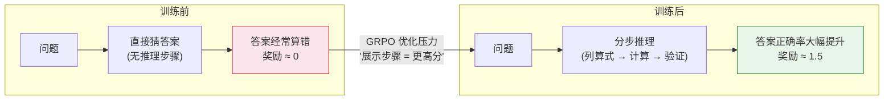

# 8.1 动手：GRPO 训练数学推理

上一章我们深入了 DPO 的理论与实践，看到它通过数学变换绕过了 RM。但 DPO 是 offline 方法——它只能从固定的偏好数据集中学习，不能在线探索。这一节我们换一个思路：**用 GRPO 在线训练一个模型做数学推理**，亲眼看看"干掉 Critic"之后训练过程是什么样的。

## 实验设置：GSM8K + 规则奖励

GSM8K 是一个包含 8500 道小学数学应用题的数据集，每道题都有明确的数值答案。这恰好是一个有"客观正确答案"的场景——不需要 RM，直接用规则判断答案是否正确：

- 答案正确：$+1.0$ 分
- 格式规范（有清晰的推理步骤）：$+0.5$ 分
- 答案错误：$0$ 分

```python
# ==========================================
# 1. 规则奖励函数
# ==========================================
import re

def rule_based_reward(prompt: str, response: str, ground_truth: str) -> float:
    """
    基于规则的奖励函数（不需要 RM！）

    参数:
        prompt: 数学题目
        response: 模型生成的推理过程和答案
        ground_truth: 标准答案

    返回:
        奖励分数 [0, 1.5]
    """
    reward = 0.0

    # 检查格式：是否包含 \\boxed{...} 格式
    has_boxed = bool(re.search(r'\\boxed\{[^}]+\}', response))
    if has_boxed:
        reward += 0.5  # 格式分

    # 提取模型给出的最终答案
    answer_match = re.search(r'\\boxed\{([^}]+)\}', response)
    if answer_match:
        model_answer = answer_match.group(1).strip()

        # 数值比较（容差 0.01）
        try:
            if abs(float(model_answer) - float(ground_truth)) < 0.01:
                reward += 1.0  # 答案正确
        except ValueError:
            # 非数值答案，直接字符串比较
            if model_answer == ground_truth:
                reward += 1.0

    return reward

# 测试一下
prompt = "Janet 的鸡蛋盒子每天能装 16 个鸡蛋。她每天早上吃 3 个，下午用 4 个烤松饼。她每周能卖多少个鸡蛋？"
good_response = """
首先计算每天剩余的鸡蛋数：16 - 3 - 4 = 9 个
每周有 7 天，所以每周能卖：9 × 7 = 63 个
\\boxed{63}
"""
bad_response = "我觉得大概能卖 50 个左右吧。\\boxed{50}"

print(f"好回答奖励: {rule_based_reward(prompt, good_response, '63')}")   # 1.5
print(f"坏回答奖励: {rule_based_reward(prompt, bad_response, '63')}")   # 0.5
```

注意这里的关键区别：**不需要训练任何 RM，规则就是裁判**。数学题有标准答案，直接比较就行。这种"可验证奖励"正是 RLVR 的核心思想（8.3 节会深入讨论）。

## 运行 GRPO 训练

我们使用 `trl` 库提供的 GRPO 实现。和 PPO 相比，GRPO 不需要 Critic 模型：

```python
# ==========================================
# 2. GRPO 训练代码（简化示意）
# ==========================================
from trl import GRPOTrainer, GRPOConfig
from transformers import AutoModelForCausalLM, AutoTokenizer

# 加载基础模型（注意：只需要一个模型！）
model_name = "Qwen/Qwen2.5-1.5B-Instruct"
model = AutoModelForCausalLM.from_pretrained(model_name)
tokenizer = AutoTokenizer.from_pretrained(model_name)

# GRPO 训练配置
config = GRPOConfig(
    output_dir="./grpo_gsm8k",
    num_generations=8,        # 每个问题生成 k=8 个回答（组大小）
    per_device_train_batch_size=4,
    learning_rate=5e-6,
    num_train_epochs=1,
    logging_steps=10,
    save_steps=100,
    # 不需要 Critic！这是 GRPO 的核心创新
)

# 注意：GRPO 只需要 model 和 reward_function
# 不需要 ref_model（内部自动创建）
# 不需要 critic_model（GRPO 用组内归一化替代）

# 加载 GSM8K 数据集
from datasets import load_dataset
gsm8k = load_dataset("openai/gsm8k", "main")

# 创建 GRPO Trainer
trainer = GRPOTrainer(
    model=model,
    args=config,
    train_dataset=gsm8k["train"],
    reward_funcs=[rule_based_reward],  # 直接传入规则奖励函数
    tokenizer=tokenizer,
)

# 开始训练
print("开始 GRPO 训练——不需要 Critic，不需要 RM")
trainer.train()
trainer.save_model("./grpo_gsm8k/final_model")
print("训练完成！")
```

## 观察训练过程

训练过程中，关注以下几个关键指标：

**显存占用对比**：GRPO vs PPO

| 模型大小 | PPO 显存（4 模型） | GRPO 显存（2 模型） | 节省比例 |
| -------- | ------------------ | ------------------- | -------- |
| 1.5B     | ~24 GB             | ~14 GB              | ~42%     |
| 7B       | ~80 GB             | ~48 GB              | ~40%     |
| 14B      | ~160 GB            | ~96 GB              | ~40%     |
| 70B      | ~640 GB            | ~384 GB             | ~40%     |

GRPO 省掉了 Critic（和 Actor 同等规模）和 RM 两个模型，通常能减少 30-40% 的显存占用。在实际工程中，这意味着原本需要 8 张 A100 的训练任务，现在 5 张就够了。

## 训练前后：推理步骤的变化

GRPO 训练最令人兴奋的观察是模型推理方式的变化。让我们看看训练前后的典型输出：

**训练前**（直接猜答案）：

```
题目：小明有 15 个苹果，给了小红 3 个，又给了小刚 5 个，还剩多少个？
回答：我觉得还剩 7 个。\\boxed{7}
```

**训练后**（展示推理过程）：

```
题目：小明有 15 个苹果，给了小红 3 个，又给了小刚 5 个，还剩多少个？
回答：
让我一步一步算：
- 小明一开始有 15 个苹果
- 给了小红 3 个：15 - 3 = 12
- 又给了小刚 5 个：12 - 5 = 7
- 所以还剩 7 个
\\boxed{7}
```

模型从"直接猜答案"变成了"先列算式再计算"——这不是我们教它的，而是模型在 GRPO 训练过程中自己"领悟"出来的。因为展示推理步骤能提高答案正确率（拿到更高的规则奖励），所以 GRPO 的优化压力自然地选择了这条路径。

这个变化可以用一个简单的流程图来概括：



## 组内方差的演化

GRPO 的核心创新是用组内归一化替代 Critic。在训练初期，同一个问题的 8 个回答质量差异很大（方差高），有的答对了有的答错了。随着训练推进，组内回答质量趋于一致（方差降低），大部分回答都能答对。

```
训练初期（Episode 10）：
  问题 "15 - 3 - 5 = ?" 的 8 个回答：[3, 7, 12, 7, 15, 7, 8, 10]
  组内方差：高（答案五花八门）
  归一化优势：[−1.2, +0.1, +0.8, +0.1, +1.5, +0.1, −0.3, +0.6]

训练中期（Episode 100）：
  同一问题的 8 个回答：[7, 7, 7, 8, 7, 7, 7, 7]
  组内方差：低（大部分答对了）
  归一化优势：[0, 0, 0, −0.5, 0, 0, 0, 0]

训练后期（Episode 300）：
  同一问题的 8 个回答：[7, 7, 7, 7, 7, 7, 7, 7]
  组内方差：接近零（全部答对）
  归一化优势：全部接近零 → 无梯度信号
```

这个演化过程揭示了一个有趣的动力学：当组内方差降为零时，优势全部为零，没有梯度信号了——模型在这个问题上"毕业"了。这正是我们想要的行为：模型不需要在已经掌握的题目上浪费时间，训练信号自然地转移到还没掌握的题目上。

<details>
<summary>思考题：如果训练初期组内方差就很低（所有回答都差不多），GRPO 还能有效训练吗？</summary>

如果组内方差过低（比如所有回答的奖励几乎相同），归一化后的优势会全部接近零，几乎没有梯度信号。模型会"不知道该学什么"。

这通常发生在以下情况：

- **问题太简单**：所有回答都能答对，没有区分度
- **模型已经很强**：基础模型的数学能力已经很好了
- **k 值太小**：采样数太少，碰巧都差不多

GRPO 通过 DAPO 的"动态采样"改进来解决这个问题——过滤掉模型已经答对的题目，只保留有梯度信号的样本。这保证了训练效率不会因为"毕业题目"而浪费。

</details>

训练过程展示了 GRPO "省掉 Critic"的实际效果。但组内归一化为什么能替代 Critic 的工作？背后的数学原理是什么？让我们深入——[GRPO 核心机制](./grpo-mechanism)。
