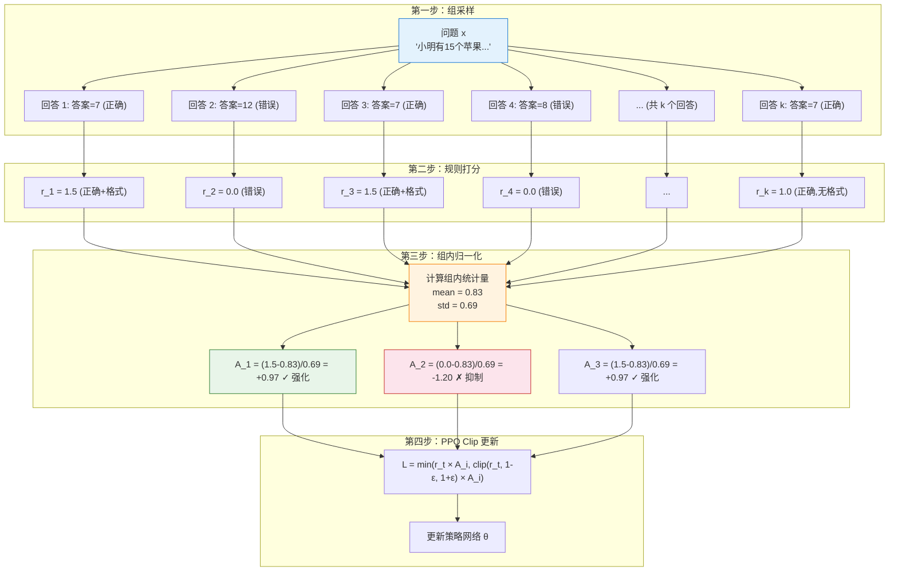

# 8.2 GRPO 核心机制——组内归一化的艺术

上一节我们跑通了 GRPO 训练，看到了"省掉 Critic"的实际效果——显存减少 30-40%，推理步骤从"猜答案"变成"列算式"。但一个核心问题还没有回答：**组内归一化为什么能替代 Critic 的工作？** Critic 的任务是提供基线——"正常情况下能跑多少分"，然后优势函数减去基线就知道"比平时好了多少"。GRPO 用组内的均值当基线，这凭什么靠谱？

## PPO Critic 的三大问题

在回答"为什么能替代"之前，先说清楚"为什么要替代"。PPO 的 Critic 在 LLM 训练中面临三个严重问题：

**1. 吃显存**：Critic 本身就是一个与 Actor 同等规模的模型。训练 PPO 时你需要同时装下 Actor + Critic + Reference + RM，四个大模型塞进显存，硬件成本翻倍。

**2. 训练不稳定**：Critic 需要学习价值函数 $V(s)$——对于 LLM 来说，这是一个从"部分生成的文本"到"最终得分预测"的映射。但 LLM 生成的序列很长（500+ tokens），而且价值函数的监督信号只在序列末尾才有。在长序列上估计价值函数的方差非常大，Critic 经常学不准。

**3. 工程复杂**：Critic 需要独立的优化器、学习率调度、梯度裁剪等配置。四个模型各有一套超参数，调参难度指数级增长。

回顾第 5 章，Critic 的核心作用是**提供基线来降低方差**。如果有一种方法不需要单独训练一个网络就能得到基线，那 Critic 就可以退休了。

从 Critic 的训练目标来看，它要学习的是 $V(s)$——"从这个状态出发，按策略执行，期望能拿多少分"。在 LLM 场景下，"状态"就是部分生成的文本，"分数"就是 RM 给的最终评分。这个映射非常难学：不同的生成路径千差万别，Critic 需要对每一种部分文本都给出准确的价值预测。更麻烦的是，随着策略不断更新，Critic 也需要不断重新学习——昨天学准的 $V(s)$，今天策略变了就不准了。这种"追逐移动目标"的训练方式本身就很不稳定。

GRPO 的洞见是：与其费力学一个 $V(s)$ 来当基线，不如直接用当前 batch 的实际得分来计算基线。既然我们对每个问题采样了 $k$ 个回答，这 $k$ 个回答的平均得分就是最好的"实时基线"——它不需要额外训练，天然就和当前策略匹配，而且随着策略更新自动更新。

## GRPO 的核心思路：用组内均值当基线

GRPO 的想法出奇地简单。对于每个问题 $x$，GRPO 采样 $k$ 个回答 $\{y_1, y_2, \ldots, y_k\}$，用奖励函数给每个回答打分 $\{r_1, r_2, \ldots, r_k\}$，然后做**组内归一化**：

$$A_i = \frac{r_i - \text{mean}(r_1, \ldots, r_k)}{\text{std}(r_1, \ldots, r_k)}$$

这个公式做的事情和 Critic 一模一样——**减去均值就是"比平均好了多少"**。只不过 Critic 用一个单独的神经网络来预测"均值"（$V(s)$），而 GRPO 直接用同一组回答的实际得分均值。



### 为什么组内归一化有效？

组内归一化有效的原因有三个：

**难度归一化**：不同题目的难度不同。简单题所有回答都正确（奖励均值很高），难题大部分回答都错误（奖励均值很低）。如果用绝对奖励，简单题的回答会获得更高的梯度信号，模型会把大部分精力花在简单题上。组内归一化消除了这种偏差——它只关注"这道题内部谁更好"，不受题目绝对难度的影响。

**相对比较更稳定**：人类偏好本质上也是比较式的（"A 比 B 好"），不是绝对的（"A 得 87 分"）。GRPO 的组内比较和人类的判断方式天然一致——不需要知道绝对分数，只需要知道相对排名。

**方差更低**：同一组内的回答共享相同的 prompt，唯一的差异是模型生成的随机性。这种"控制变量"式的比较比跨样本的绝对评分更稳定——就像科学实验中，控制其他条件只改变一个变量，结论更可靠。

为了更直观地理解难度归一化的效果，考虑两个题目：一道简单题和一道难题。简单题的 8 个回答可能全部正确（奖励均值 1.0），难题的 8 个回答可能只有 1 个正确（奖励均值 0.125）。如果用绝对奖励，简单题的梯度信号远强于难题——模型会把大部分精力花在已经掌握的简单题上。但经过组内归一化后，两个题目的优势分布范围是相同的（都在 $[-\sigma, +\sigma]$ 之间），模型在两类题目上获得均衡的学习信号。这是 GRPO 相比 PPO 的一个微妙但重要的优势——PPO 的 Critic 需要额外学习不同题目的价值差异，而 GRPO 的组内归一化天然实现了这一点。

## GRPO 与 PPO 的对比

一句话总结：**GRPO = PPO 的裁剪机制 + 用组内排名替代 Critic**。

| 组件           | PPO                               | GRPO                               |
| -------------- | --------------------------------- | ---------------------------------- |
| 基线（Critic） | 独立的 $V(s)$ 网络                | 组内均值 $\bar{r}$                 |
| 优势计算       | $A = R - V(s)$ 或 GAE             | $A_i = (r_i - \bar{r}) / \sigma_r$ |
| 模型数量       | 4 个（Actor + Critic + Ref + RM） | 2 个（Actor + Ref）                |
| 裁剪机制       | PPO Clip                          | 同样的 PPO Clip                    |
| 采样方式       | 在线交互                          | 组采样（每个 prompt 采 k 个）      |
| 显存           | 高                                | 低 30-40%                          |
| 基线质量       | 依赖 Critic 训练质量              | 依赖组大小 $k$                     |
| 基线更新速度   | 需要重新训练 Critic               | 自动随 batch 更新                  |

值得注意的是，GRPO 继承了 PPO 的裁剪机制，但没有继承 GAE。原因是 GRPO 的奖励通常只在序列末尾给出一个信号（答对/答错），而不是每个 token 都有奖励。在这种情况下，GAE 的多步 TD 退化为单步，和直接用最终奖励减去均值没有本质区别。这是 LLM 场景的一个特殊性——和游戏环境每步都有即时奖励不同，LLM 的奖励信号天然就是稀疏的。

## 训练曲线分析

GRPO 的训练过程中有几个值得关注的指标：

**Reward 均值**：随着训练推进，组内平均奖励逐渐上升，说明模型在越来越多的题目上答对了。

**组内方差**：这是 GRPO 独有的指标。训练初期方差高（组内回答质量参差不齐），训练后期方差低（大部分回答质量趋同）。方差接近零意味着模型在这个问题上"毕业"了。

**回答长度**：一个常见的观察是，GRPO 训练后回答会变长——模型学会了展示推理步骤（因为推理步骤能提高答案正确率）。但如果回答长度失控增长（比如从 100 token 涨到 2000 token），可能需要加长度惩罚。

**k 值的影响**：k（组大小）是 GRPO 最关键的超参数。

| k 值 | 采样成本                | 归一化质量               | 适用场景     |
| ---- | ----------------------- | ------------------------ | ------------ |
| 2    | 低（每个问题只采 2 次） | 差（均值和标准差不稳定） | 快速验证     |
| 4    | 中等                    | 一般                     | 资源有限时   |
| 8    | 较高                    | 良好                     | **默认推荐** |
| 16   | 高                      | 很好（统计量更稳定）     | 追求上限     |
| 64   | 很高                    | 极好                     | 大规模训练   |

```python
# ==========================================
# GRPO 组内归一化的简单实现
# ==========================================
import numpy as np

def grpo_group_normalize(rewards: list[float]) -> list[float]:
    """
    GRPO 的组内归一化

    对每个问题的一组回答的奖励做归一化
    """
    rewards = np.array(rewards, dtype=float)

    # 计算组内均值和标准差
    mean = rewards.mean()
    std = rewards.std()

    # 防止除零（所有奖励相同时）
    if std < 1e-8:
        return np.zeros_like(rewards)

    # 归一化
    advantages = (rewards - mean) / std
    return advantages

# 示例：8 个回答的奖励
rewards = [1.5, 0.0, 1.5, 0.0, 1.0, 1.5, 0.5, 1.5]
advantages = grpo_group_normalize(rewards)

print("原始奖励:", rewards)
print("归一化优势:", np.round(advantages, 2))
print("均值:", np.mean(rewards))
print("标准差:", np.std(rewards))

# 输出示例：
# 原始奖励: [1.5, 0.0, 1.5, 0.0, 1.0, 1.5, 0.5, 1.5]
# 归一化优势: [ 0.82 -1.23  0.82 -1.23  0.12  0.82 -0.53  0.82]
# 均值: 0.875
# 标准差: 0.637
```

<details>
<summary>思考题：GRPO 的组内归一化在什么情况下会失效？</summary>

有几种情况可能导致组内归一化失效：

1. **k 太小**：当 $k=2$ 时，均值和标准差都非常不稳定。两个样本的统计量几乎不能代表真实的分布特征。这就像你只问了两个人"这个电影好不好看"，就得出"大众评价"——结论不可靠。

2. **奖励分布极其偏斜**：如果大部分回答都得零分（错误），只有极少数回答得分，标准差可能很小，归一化后的优势值可能被少数高分回答主导。

3. **所有回答质量相同**：如果组内所有回答都正确（或都错误），方差为零，优势全部为零，没有梯度信号。这就是训练后期"毕业"的现象——模型在这些题目上不再学习了。

4. **奖励信号不连续**：如果奖励只有 0 和 1 两个值（答对/答错），归一化后的优势分布是离散的。和连续奖励相比，梯度信号可能不够精细。

</details>

GRPO 通过组内归一化优雅地解决了 Critic 的问题。但这只是第一步——在奖励端，还有更大的革新正在发生。DeepSeek-R1-Zero 证明了不需要 SFT 也能做纯 RL 训练，RLVR 用可验证奖励取代了人工标注。让我们看看这些前沿进展——[DeepSeek-R1-Zero、DAPO 与 RLVR](./deepseek-dapo-rlvr)。
