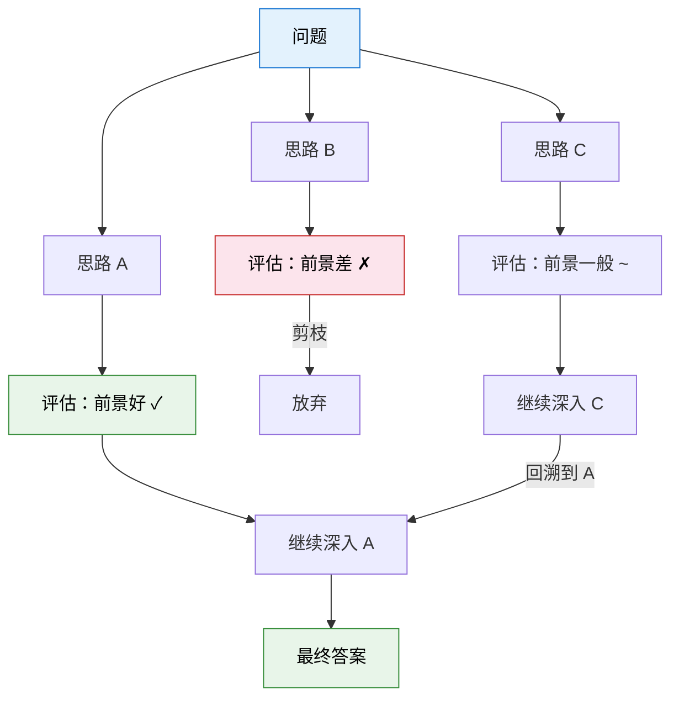

# 13.1 测试时计算与 RL 推理

到第 8 章为止，我们讨论的所有 RL 方法都有一个共同的范式：**训练时消耗大量算力来优化策略，推理时直接用训练好的策略做前向传播**。PPO 训练可能需要几百块 GPU 跑几天，但推理只需要毫秒——模型"不假思索"地给出回答。这个范式在过去几年里非常成功，但它有一个隐含的假设：模型在推理时不需要"思考"。

2024-2025 年，这个假设被打破了。OpenAI 的 o1/o3 和 DeepSeek 的 R1 展示了一种全新的范式：**让模型在推理时花更多时间"思考"，可以显著提升回答质量**。这不是简单地让模型生成更长的回答，而是让模型学会在推理过程中进行搜索、验证、回溯——这些策略性的决策能力，正是 RL 训练出来的。

## 传统范式：训练时计算 vs 推理时计算

让我们先理清"训练时计算"和"推理时计算"的区别：

|            | 训练时计算               | 推理时计算                   |
| ---------- | ------------------------ | ---------------------------- |
| 发生在     | 训练阶段（离线）         | 使用阶段（在线）             |
| 目的       | 优化模型参数，让策略更好 | 用训练好的策略解决具体问题   |
| 算力消耗   | 巨大（几百 GPU × 几天）  | 很小（单次前向传播）         |
| 可重复利用 | 是（训练一次，永久使用） | 否（每个新问题都要重新推理） |
| 代表方法   | PPO、DPO、GRPO           | Greedy Decoding、Beam Search |

传统 RL 范式把几乎所有算力都花在训练上，推理时"一次性输出"。这就像一个学生花了 12 年读书（训练），然后在考试中"本能地"写出答案（推理）——不检查、不反思、不尝试其他解法。

## 新范式：推理时搜索

新范式的核心洞察是：**推理时多花一些算力让模型"搜索"和"反思"，可以显著提升回答质量，而且这种"搜索策略"本身可以通过 RL 训练**。

### Tree of Thought（ToT）

标准的思维链（Chain-of-Thought）让模型沿着一条路径推理——从第一步到最后一步，中间不回头。Tree of Thought 则允许模型在每一步**生成多个候选思路**，然后评估每个思路的前景，选择最有希望的继续探索。



ToT 的关键在于"评估"这一步——模型需要判断"这个思路有没有前途"。这个判断能力从哪来？答案正是 RL：通过 RL 训练，模型学会了"哪些推理路径更可能通向正确答案"。

### MCTS：在语言空间中搜索

第 5 章 AlphaGo 的简单复现中，我们见过蒙特卡洛树搜索（MCTS）。AlphaGo 用 MCTS 在棋盘上搜索——每一步模拟多个可能的走法，评估每个走法的胜率，然后选择胜率最高的。

同样的思路被迁移到了语言推理中。模型在每一步生成多个候选的"下一步推理"，用价值网络评估每个候选的前景，然后选择最有希望的继续。这就是 AlphaZero 系列方法在语言领域的直接应用。

## OpenAI o1/o3：推理时的 Chain-of-Thought

OpenAI 的 o1（2024 年 9 月）和 o3（2024 年 12 月）是这个新范式最著名的代表。它们的核心创新不是模型架构的变化，而是**推理方式的变化**：

- o1 在给出最终回答之前，会先进行一段内部的"思考过程"（chain-of-thought）。这个思考过程对用户不可见，但模型在其中进行了多步推理、验证和修正。
- o3 进一步强化了这个能力，特别是在数学和编程等需要严格推理的任务上。在 ARC-AGI 基准测试上，o3 达到了 87.5% 的准确率，而此前的最佳成绩只有约 30%。

OpenAI 并没有公开 o1/o3 的训练细节，但从外部分析和论文中可以推断，RL 在其中扮演了关键角色：

1. **SFT 阶段**：先用人工标注的推理轨迹做监督微调，教模型"怎么写推理步骤"
2. **RL 阶段**：然后用 RL 优化推理策略。Reward 是最终答案的正确性（又是 RLVR！）。模型通过试错学会了"在推理过程中验证中间步骤"、"发现错误时回溯并尝试新路径"等策略
3. **推理阶段**：模型用 RL 训练出的推理策略进行搜索，花更多算力来提升回答质量

## DeepSeek-R1：RL 涌现推理能力

如果说 o1/o3 展示了"推理时搜索"的效果，那么 DeepSeek-R1 则揭示了一个更深层的问题：**RL 训练本身可以"涌现"出推理能力**。

DeepSeek-R1 的训练过程有一个令人惊讶的发现。研究者发现，当他们对基座模型直接做 RL 训练（不做 SFT，不给推理轨迹示例），模型**自发地**学会了一些推理策略：

- **自我验证**：模型在推理过程中会自动检查中间步骤是否正确
- **反思修正**：发现错误时，模型会回溯并尝试新的推理路径
- **探索与利用**：模型学会了在"确认有把握的推理路径"和"尝试新的推理方式"之间平衡

这些能力不是人为设计的——没有任何训练数据教模型"你应该在第三步检查一下前两步的推理是否正确"。它们是 RL 优化过程中**自然涌现**出来的。当 reward 只看最终答案是否正确时，模型发现"中间验证"是提高最终正确率的有效策略，于是就学会了自我验证。

$$J(\theta) = \mathbb{E}_{\pi_\theta}\left[\mathbb{1}(\text{最终答案正确})\right]$$

这个目标函数看起来极其简单——只是"最大化答案正确的概率"。但 DeepSeek-R1 的实验表明，从这个简单的目标出发，RL 可以涌现出复杂的推理行为。这和第 5 章策略梯度定理的精神一致：你只需要告诉模型"什么是好的"，模型自己会摸索出"怎么做到好"。

## 开放问题：RL 和推理的上限在哪里？

测试时计算和 RL 推理是当前最热门的研究方向之一，但也留下了许多开放问题：

**算力分配问题**。训练时算力和推理时算力应该怎么分配？花更多算力训练一个更强的模型，还是花更多算力让现有模型"想更久"？目前的研究表明两者是互补的，但最优的分配比例尚不清楚。一篇 2025 年的论文发现：对于数学推理任务，推理时搜索带来的提升在"中等训练程度"的模型上最显著——训练过少的模型连基础推理都做不好，搜索帮不上忙；训练过多的模型已经内化了最优策略，搜索的边际收益递减。

**推理策略的泛化**。模型通过 RL 学到的推理策略（自我验证、回溯等）能否泛化到训练中没见过的任务类型？如果能，这种泛化的边界在哪里？目前的证据是混杂的：DeepSeek-R1 在数学推理中学到的自我验证策略似乎可以迁移到编程任务，但在创意写作等任务上的效果不确定。

**推理效率**。o1/o3 的推理过程可能需要几十秒甚至几分钟，这在实时应用中是不可接受的。如何在推理质量和效率之间取得平衡？一种思路是**自适应推理时间**——简单问题少想一会儿，复杂问题多想一会儿。这实际上又是一个 RL 问题：模型需要学会"判断当前问题有多难，应该花多少时间思考"。

```python
def adaptive_inference(question, model, max_thinking_steps=20):
    """自适应推理：根据问题复杂度动态调整思考时间"""
    # 第一步：模型快速评估问题难度
    difficulty = model.estimate_difficulty(question)  # 0-1 之间

    # 根据难度决定思考步数
    thinking_budget = int(difficulty * max_thinking_steps)
    thinking_budget = max(1, thinking_budget)  # 至少思考一步

    # 在思考预算内进行搜索
    best_answer = None
    best_score = -float("inf")

    for step in range(thinking_budget):
        candidate = model.think_step(question, step)
        score = model.self_evaluate(candidate)
        if score > best_score:
            best_answer = candidate
            best_score = score

        # 如果已经足够确信，提前停止
        if best_score > 0.95:
            break

    return best_answer
```

这个自适应推理的思路非常优雅：模型不仅在用 RL 训练出来的策略做推理，还在用 RL 训练出来的"元策略"来决定推理资源怎么分配。这是"RL on top of RL"——RL 不仅优化了推理策略，还优化了推理资源的分配策略。

**推理的可解释性**。o1/o3 的内部思考过程对用户不可见。这带来了一个困境：如果用户能看到思考过程，就能更好地理解模型的推理逻辑（也更信任它）；但公开思考过程可能被用来"蒸馏"模型的能力。OpenAI 选择了不公开，但这意味着我们无法完全理解模型在推理过程中到底做了什么。

**Scaling Law of Test-Time Compute**。一个更深层的问题是：推理时算力和回答质量之间的关系是什么？是否存在一个"推理 Scaling Law"，就像训练时的 Scaling Law（更大的模型 + 更多数据 = 更好的性能）一样？初步的研究表明，增加推理时算力确实能持续提升回答质量，但提升的幅度会递减——每多花一倍算力，质量提升越来越小。最优的"推理预算"取决于任务的难度和可用的时间。

## 测试时计算与前面章节的联系

测试时计算的核心思想——"在推理时搜索和规划"——和前面章节学过的多个概念有直接联系：

| 前面章节的概念             | 在测试时计算中的对应                  |
| -------------------------- | ------------------------------------- |
| MCTS（第 5 章）            | 语言空间中的树搜索（Tree of Thought） |
| 价值函数 $V(s)$（第 3 章） | 评估"当前推理步骤的前景"              |
| 策略梯度（第 5 章）        | RL 训练推理策略（何时验证、何时回溯） |
| RLVR（第 8 章）            | reward = 最终答案是否正确             |
| GRPO 组内比较（第 8 章）   | 多条推理路径的比较与选择              |

最核心的联系是：**测试时计算的搜索策略，本质上就是 RL 训练出来的"元策略"**。模型不是在推理时随机尝试——它用 RL 训练出的策略来决定"先尝试哪条路径、什么时候放弃、什么时候深入探索"。这和 AlphaGo 用 RL 训练 MCTS 的搜索策略是完全一样的思路，只是从棋盘空间迁移到了语言推理空间。

<details>
<summary>思考题：DeepSeek-R1 的"涌现推理能力"和第 5 章 REINFORCE 的"策略梯度"有什么联系？</summary>

REINFORCE 的核心思想是：你只需要告诉模型"最终结果好不好"（通过 reward），模型就能自己学会"该怎么行动"（通过策略梯度）。DeepSeek-R1 做的是同样的事——reward 只看"最终答案对不对"，模型自己学会了"推理过程中该怎么做"（自我验证、回溯等策略）。

区别在于：REINFORCE 面对的是简单的动作空间（选 A 或选 B），而 DeepSeek-R1 面对的是复杂的"推理动作空间"（生成哪段推理文本、是否回溯、是否验证）。但数学本质是一样的——都是策略梯度定理的应用。

</details>

| 方法            | 核心思路                          | RL 的角色          | 推理时开销 |
| --------------- | --------------------------------- | ------------------ | ---------- |
| 标准 CoT        | 一次性生成推理链                  | 无（SFT 学会格式） | 低         |
| Tree of Thought | 多分支搜索 + 剪枝                 | RL 训练评估函数    | 中         |
| MCTS            | 蒙特卡洛树搜索                    | RL 训练价值网络    | 高         |
| OpenAI o1/o3    | 内部隐式搜索（具体机制未公开）    | RL 训练推理策略    | 高         |
| DeepSeek-R1     | RL 直接涌现推理能力（自我验证等） | RL 是核心训练方法  | 中-高      |

测试时计算让我们重新思考了"训练和推理的边界"。下一节，我们将目光从数字世界转向物理世界——[多模态与具身智能](./embodied-multimodal)，看看 RL 在机器人、自动驾驶等领域的挑战和机遇。
